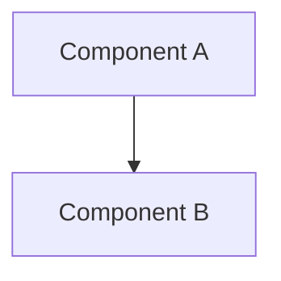

# Design Document: [Feature / Component Name]

> **SDLC Phase:** 2 (Design)
> **Date:** YYYY-MM-DD
> **Author:** [Name or @Harness → Analyst agent]

---

## Overview

<!-- One paragraph summary of what this designs -->

## Goals

1. 
2. 
3. 

## Non-Goals

- 

## Architecture

<!-- High-level architecture diagram (mermaid or text) -->



## Detailed Design

### Component 1: [Name]

**Responsibility:**

**Pattern:** (e.g., Repository Pattern via `the approved Cosmos DB library`)

**Key interfaces:**

```python
# Example interface
```

### Component 2: [Name]

**Responsibility:**

**Pattern:**

## Data Model

### Entities

| Entity | Base Class | Key Type | Container |
|---|---|---|---|
| | `RootEntityBase["Name", str]` | `str` | |

### Relationships

## Azure Services

| Service | Library | Configuration |
|---|---|---|
| Cosmos DB | `the approved Cosmos DB library` | |
| Blob Storage | `the approved Storage library` | |
| Container Apps | AVM module | |

## Error Handling & Logging

- 

## Security Considerations

- [ ] Authentication method defined
- [ ] Authorization model specified
- [ ] Data encryption at rest and in transit
- [ ] Secrets management via Key Vault

## Testing Approach

| Test Type | Scope | Framework |
|---|---|---|
| Unit | Service logic | pytest |
| Integration | API endpoints | pytest + httpx |
| E2E | Full flow | Playwright (if applicable) |

## Dependencies

| Dependency | Version | Source |
|---|---|---|
| `the approved Cosmos DB library` | latest | Reference catalog |
| `the approved Storage library` | latest | Reference catalog |

## Open Questions

- [ ] 
