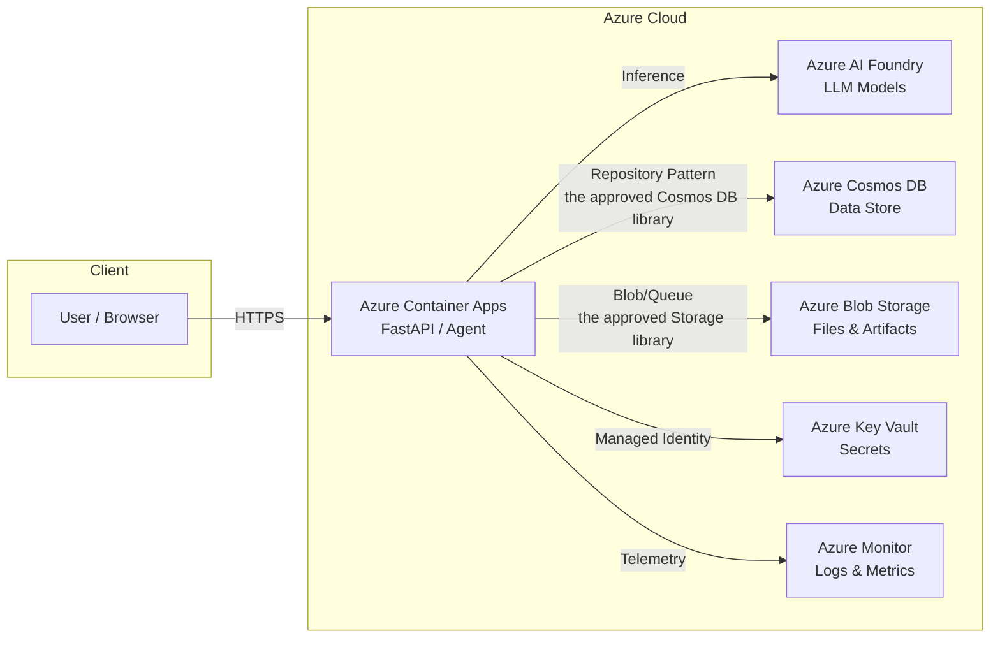

# <PROJECT_NAME>

<!-- 
  README Template for SDLC-aligned projects
  Based on enterprise application standards + SDLC lifecycle integration
  
  Instructions:
  1. Replace all <PLACEHOLDER> values with your project-specific content
  2. Add architecture diagram images under docs/images/readme/
  3. Update the cost table with your actual Azure resources
  4. Remove sections that don't apply (e.g., RAI section if no AI)
  5. Delete this comment block when done
-->

<SHORT_DESCRIPTION — 2-3 sentences describing what this solution does, the business problem it solves, and who it's for.>

<br/>

<div align="center">

[**SOLUTION OVERVIEW**](#solution-overview) \| [**QUICK DEPLOY**](#quick-deploy) \| [**BUSINESS SCENARIO**](#business-scenario) \| [**SUPPORTING DOCUMENTATION**](#supporting-documentation)

</div>

<br/>

> **Note:** This project follows the [SDLC with GitHub Copilot and Azure](/.github/SDLC-with-Copilot-and-Azure.md)
> lifecycle. See the [README](/README.md) for AI-assisted development guidance.

> **Responsible AI:** With any AI solutions you create, you are responsible for assessing all
> associated risks and for complying with all applicable laws and safety standards.
> Learn more in the [Transparency FAQ](./docs/TRANSPARENCY_FAQ.md).

<br/>

---

<h2>
Solution Overview
</h2>

<HIGH_LEVEL_DESCRIPTION — Describe the solution architecture, key Azure services used, and the overall approach.>

### Solution Architecture

<!-- 
  Replace the sample Mermaid diagram below with your actual solution architecture.
  Mermaid renders natively on GitHub and in VS Code preview.
  Reference: https://mermaid.js.org/syntax/flowchart.html
-->



### Key Features

<details open>
  <summary>Click to learn more about the key features</summary>

  - **Feature 1** <br/>
    Description of feature 1.

  - **Feature 2** <br/>
    Description of feature 2.

  - **Feature 3** <br/>
    Description of feature 3.

</details>

### Tech Stack

| Layer            | Technology                                           |
| ---------------- | ---------------------------------------------------- |
| Language         | Python 3.12+                                         |
| Framework        | <FastAPI / Azure AI Agent Framework / Custom>        |
| Package Manager  | UV                                                   |
| Data Access      | `the approved Cosmos DB library` (PyPI) — Cosmos DB Repository Pattern |
| Storage          | `the approved Storage library` (PyPI) — Azure Blob + Queue            |
| Containerization | Docker (mandatory)                                   |
| Hosting          | Azure Container Apps                                 |
| Infrastructure   | Bicep (AVM modules)                                  |
| Deployment       | Azure Developer CLI (`azd`)                          |
| CI/CD            | GitHub Actions / Azure DevOps                        |

### Additional Resources

- [Azure AI Foundry Documentation](https://learn.microsoft.com/en-us/azure/ai-foundry/)
- [Azure Container Apps Documentation](https://learn.microsoft.com/en-us/azure/container-apps/)
- [Azure Cosmos DB Documentation](https://learn.microsoft.com/en-us/azure/cosmos-db/)
- <ADD_RELEVANT_DOCS>

<br/>

---

<h2>
Quick Deploy
</h2>

### One-click deployment

| [](https://codespaces.new/<ORG>/<REPO>) | [](https://vscode.dev/redirect?url=vscode://ms-vscode-remote.remote-containers/cloneInVolume?url=https://github.com/<ORG>/<REPO>) |
| ------------------------------------------------------------------------------------------------------------ | ------------------------------------------------------------------------------------------------------------------------------------------------------------------------------------------------------------------------------------------------------------------------------------- |

### Prerequisites

- [Azure subscription](https://azure.microsoft.com/free/) with permissions to create resource groups and resources
- [Azure Developer CLI (azd)](https://learn.microsoft.com/en-us/azure/developer/azure-developer-cli/install-azd) v1.18.0+
- [Python 3.12+](https://www.python.org/downloads/)
- [UV package manager](https://docs.astral.sh/uv/)
- [Docker](https://www.docker.com/get-started/) (for Codespaces / Dev Containers)

### Deploy with Azure Developer CLI

```bash
# 1. Clone the repository
git clone https://github.com/<ORG>/<REPO>.git
cd <REPO>

# 2. Login to Azure
azd auth login

# 3. Provision infrastructure and deploy
azd up

# 4. (Optional) Configure environment per service
cp src/api/.env.example src/api/.env
cp src/agent/.env.example src/agent/.env
# Edit .env files with your settings
```

> ⚠️ **Check Azure OpenAI Quota:** Ensure sufficient quota is available in your subscription
> before deployment. See the [quota check guide](./docs/quota_check.md).

### Infrastructure: Azure Verified Modules (AVM)

This project uses [Azure Verified Modules (AVM)](https://azure.github.io/Azure-Verified-Modules/)
for Bicep-based infrastructure provisioning, ensuring best practices and security defaults.

```
infra/
├── main.bicep                    # Main deployment entry point
├── main.parameters.json          # Default parameters
├── abbreviations.json            # Azure resource abbreviations
└── modules/                      # AVM-based modules
    ├── ai-foundry.bicep          # Azure AI Foundry resources
    ├── cosmos-db.bicep           # Cosmos DB account + databases
    ├── container-apps.bicep      # Container Apps environment
    ├── storage.bicep             # Storage account
    └── monitoring.bicep          # Log Analytics + App Insights
```

**AVM module usage example:**

```bicep
// Using AVM module for Cosmos DB
module cosmosDb 'br/public:avm/res/document-db/database-account:0.8.1' = {
  name: 'cosmosDbDeployment'
  params: {
    name: '${abbrs.documentDBDatabaseAccounts}${resourceToken}'
    location: location
    // AVM handles security defaults, diagnostics, RBAC
  }
}
```

### Costs

Pricing varies per region and usage. Use the [Azure Pricing Calculator](https://azure.microsoft.com/en-us/pricing/calculator)
to estimate costs for your subscription.

| Product                                                                       | Description         | Pricing                                                                                   |
| ----------------------------------------------------------------------------- | ------------------- | ----------------------------------------------------------------------------------------- |
| [Azure OpenAI Service](https://learn.microsoft.com/azure/ai-services/openai/) | AI model inference  | [Pricing](https://azure.microsoft.com/pricing/details/cognitive-services/openai-service/) |
| [Azure Container Apps](https://learn.microsoft.com/azure/container-apps/)     | Application hosting | [Pricing](https://azure.microsoft.com/pricing/details/container-apps/)                    |
| [Azure Cosmos DB](https://learn.microsoft.com/azure/cosmos-db/)               | Data storage        | [Pricing](https://azure.microsoft.com/pricing/details/cosmos-db/)                         |
| [Azure Blob Storage](https://learn.microsoft.com/azure/storage/blobs/)        | File/blob storage   | [Pricing](https://azure.microsoft.com/pricing/details/storage/blobs/)                     |
| <ADD_YOUR_SERVICES>                                                           |                     |                                                                                           |

> ⚠️ **Important:** To avoid unnecessary costs, remember to tear down your deployment when no longer in use:
> `azd down`

<br/>

---

<h2>
Business Scenario
</h2>

|  |
| --------------------------------------------------------------- |

<BUSINESS_CONTEXT — Describe the business problem, target users, and challenges they face.>

### Business Value

<details>
  <summary>Click to learn more about the business value</summary>

  - **Value 1** <br/>
    Description.

  - **Value 2** <br/>
    Description.

  - **Value 3** <br/>
    Description.

</details>

### Use Cases

<details>
  <summary>Click to learn more about supported use cases</summary>

| Use Case     | Persona   | Challenges   | Approach   |
| ------------ | --------- | ------------ | ---------- |
| <USE_CASE_1> | <PERSONA> | <CHALLENGES> | <APPROACH> |
| <USE_CASE_2> | <PERSONA> | <CHALLENGES> | <APPROACH> |

</details>

<br/>

---

<h2>
Supporting Documentation
</h2>

### Development

This project follows the **SDLC with GitHub Copilot** lifecycle.
See the [README](/README.md) for complete development guidance.

| Resource                                                | Description                      |
| ------------------------------------------------------- | -------------------------------- |
| [SDLC Lifecycle](/.github/SDLC-with-Copilot-and-Azure.md) | 9-phase development lifecycle    |
| [Reference Catalog](/.github/reference-catalog.md)      | Reusable libraries and templates |

**Prompt files** for Copilot-assisted development:

| Phase                  | Prompt File                                                                                 |
| ---------------------- | ------------------------------------------------------------------------------------------- |
| Requirements & Design  | [`.github/prompts/requirement-and-design.prompt.md`](/.github/prompts/requirement-and-design.prompt.md)     |
| Repo Structure & CI/CD | [`.github/prompts/repo-structure-and-cicd.prompt.md`](/.github/prompts/repo-structure-and-cicd.prompt.md)   |
| Deployment & Infra     | [`.github/prompts/deployment.prompt.md`](/.github/prompts/deployment.prompt.md)                             |
| Implementation & Tests | [`.github/prompts/implementation-and-tests.prompt.md`](/.github/prompts/implementation-and-tests.prompt.md) |
| Documentation          | [`.github/prompts/repo-documentation.prompt.md`](/.github/prompts/repo-documentation.prompt.md)             |
| QA, RAI & Release      | [`.github/prompts/qa-rai-release.prompt.md`](/.github/prompts/qa-rai-release.prompt.md)                     |

### Security Guidelines

This template uses [Managed Identity](https://learn.microsoft.com/entra/identity/managed-identities-azure-resources/overview)
for Azure authentication. Azure Key Vault stores all connection strings.

Recommended additional security measures:

- Enable [Microsoft Defender for Cloud](https://learn.microsoft.com/en-us/azure/defender-for-cloud/)
- Protect Azure Container Apps with a [firewall](https://learn.microsoft.com/azure/container-apps/waf-app-gateway)
  and/or [Virtual Network](https://learn.microsoft.com/azure/container-apps/networking)
- Enable [GitHub secret scanning](https://docs.github.com/code-security/secret-scanning/about-secret-scanning)

### Cross References

| Related Project         | Description   |
| ----------------------- | ------------- |
| <RELATED_PROJECT_1> | <DESCRIPTION> |
| <RELATED_PROJECT_2> | <DESCRIPTION> |

<br/>

---

## Provide Feedback

Have questions, find a bug, or want to request a feature?
[Submit a new issue](https://github.com/<ORG>/<REPO>/issues) and we'll connect.

## Responsible AI Transparency FAQ

Please refer to [Transparency FAQ](./docs/TRANSPARENCY_FAQ.md) for responsible AI transparency details.

## Disclaimers

This release is an artificial intelligence (AI) system that generates text based on user input.
The text generated by this system may include ungrounded content, meaning that it is not verified
by any reliable source or based on any factual data. The data included in this release is synthetic,
meaning that it is artificially created by the system and may contain factual errors or inconsistencies.
Users of this release are responsible for determining the accuracy, validity, and suitability of any
content generated by the system for their intended purposes.

This release only supports English language input and output unless otherwise specified.

This release does not reflect the opinions, views, or values of Microsoft Corporation or any of its
affiliates, subsidiaries, or partners. Microsoft disclaims any liability or responsibility for any
damages, losses, or harms arising from the use of this release or its output.

This Software requires the use of third-party components which are governed by separate proprietary or
open-source licenses as identified below, and you must comply with the terms of each applicable license.
You must also comply with all domestic and international export laws and regulations that apply to the
Software. For further information on export restrictions, visit https://aka.ms/exporting.

BY ACCESSING OR USING THE SOFTWARE, YOU ACKNOWLEDGE THAT THE SOFTWARE IS NOT DESIGNED OR INTENDED TO
SUPPORT ANY USE IN WHICH A SERVICE INTERRUPTION, DEFECT, ERROR, OR OTHER FAILURE OF THE SOFTWARE COULD
RESULT IN THE DEATH OR SERIOUS BODILY INJURY OF ANY PERSON OR IN PHYSICAL OR ENVIRONMENTAL DAMAGE.
