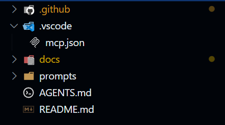

<!--
IMPORTANT: This file is a TUTORIAL FOR HUMANS ONLY.
AI agents and Copilot MUST NOT use this file as instructions, context, or a source of
code patterns. The sample "Document Manager" application described here is fictional
and used solely for educational purposes.

Agents should read their own agent files (.github/agents/*.agent.md), the reference catalog
(.github/reference-catalog.md), and quality instructions (.github/instructions/*.instructions.md)
— NOT this hands-on guide.
-->

# Hands-On Guide: SDLC Agent Template — End-to-End Walkthrough

> **⚠️ This document is for human readers only.** It is a tutorial walkthrough with a
> fictional sample application. AI agents should not use this file for code generation,
> design decisions, or as a reference for real implementations.

This guide walks you through the complete SDLC lifecycle using a real sample application.
By following every step, you'll see how the **subagent system** and **prompt files** work
together to deliver a production-ready GSA.

> **Two ways to work:** Each step shows the **agent-driven** approach (using Sassy, the SDLC Agent Coordinator)
> and the **manual prompt** approach (using prompt files directly). Both produce the same result —
> choose whichever fits your workflow.

## Sample Application: Document Manager

A full-stack application that lets users upload, browse, and download documents —
with an AI agent that automatically analyzes, summarizes, and answers questions about document content.

| Component   | Technology                             | Purpose                                    |
| ----------- | -------------------------------------- | ------------------------------------------ |
| **API**     | Python 3.12 + FastAPI                  | REST endpoints for document CRUD           |
| **Web**     | React + TypeScript                     | Upload/browse/download UI + chat interface |
| **Agent**   | Python 3.12 + Azure AI Agent Framework | Document analysis, summarization, and Q&A  |
| **Data**    | Azure Cosmos DB via `sas-cosmosdb`     | Document metadata + analysis results       |
| **Files**   | Azure Blob Storage via `sas-storage`   | Document file storage                      |
| **AI**      | Azure AI Foundry (OpenAI models)       | LLM inference for agent                    |
| **Hosting** | Azure Container Apps                   | API, Web, and Agent in shared environment  |
| **Infra**   | Bicep + AVM                            | Infrastructure as Code                     |
| **Deploy**  | Azure Developer CLI (`azd`)            | One-command deployment                     |

---

## Prerequisites

- [VS Code](https://code.visualstudio.com/) with GitHub Copilot + Copilot Chat extensions
- [Python 3.12+](https://www.python.org/downloads/)
- [uv](https://docs.astral.sh/uv/) package manager
- [Node.js 20+](https://nodejs.org/) (for React frontend)
- [Docker](https://www.docker.com/get-started/) (for MCP servers and dev containers)
- [Azure Developer CLI (azd)](https://learn.microsoft.com/en-us/azure/developer/azure-developer-cli/install-azd) v1.18.2+
- [Azure CLI](https://learn.microsoft.com/en-us/cli/azure/install-azure-cli)
- Azure subscription with permissions to create resources

Verify the MCP servers are configured — open `.vscode/mcp.json` and confirm these 5 servers:
**GitHub**, **awesome-copilot**, **Azure**, **Microsoft Learn**, **Context7**.

---

## Step 0: Clone the SDLC Template and Set Up the Project

### 0.1 Clone and create your project repo

```bash
# Clone the SDLC template
git clone https://github.com/<ORG>/sdl_with_agent.git document-manager
cd document-manager

# Remove the template's git history, start fresh
rm -rf .git
git init
git add .
git commit -m "Initial commit from SDLC template"
```

### 0.2 Set the project name in `.github/copilot-instructions.md`

Open `.github/copilot-instructions.md` and replace **only** the project name:

| Placeholder              | Value for this project   | When it's filled                              |
| ------------------------ | ------------------------ | --------------------------------------------- |
| `<PROJECT_NAME>`         | `document-manager`       | **Now** (you always know this)                |
| `<BUSINESS_DOMAIN>`      | *(leave as placeholder)* | Sassy fills after your first task description |
| `<TECH_STACK>`           | *(leave as placeholder)* | Analyst fills during Phase 2 design           |
| `<ARCH_STYLE>`           | *(leave as placeholder)* | Analyst fills during Phase 2 design           |
| `<OTHER_AZURE_SERVICES>` | *(leave as placeholder)* | Deployer fills during Phase 3 infra           |
| `<LOGGER_ABSTRACTION>`   | *(leave as placeholder)* | Implementer fills during Phase 4              |

> **Why only the project name?** The remaining values are discovered during the SDLC process.
> When you first talk to `@Sassy`, it detects unfilled placeholders, asks you 2-3 quick
> questions, and fills what it can. As each phase completes, agents progressively update
> the remaining values from actual design decisions — not guesses.

### 0.3 Select quality instruction files

For this project we need all 6 quality files (Python backend + TypeScript/React frontend):
- ✅ `.github/instructions/code-quality-py.instructions.md`
- ✅ `.github/instructions/code-quality-ts.instructions.md`
- ✅ `.github/instructions/code-quality-tsx.instructions.md`
- ✅ `.github/instructions/test-quality.instructions.md`
- ✅ `.github/instructions/test-quality-ts.instructions.md`
- ✅ `.github/instructions/test-quality-tsx.instructions.md`

All are already in `.github/instructions/` — no action needed.

### 0.4 Open in VS Code

```bash
code .
```

Verify Copilot is active and the MCP servers are configured (`.vscode/mcp.json` should list
GitHub, awesome-copilot, Azure, Microsoft Learn, and Context7).

Also verify the **Sassy** agent is available in Copilot Chat's agent dropdown
(it reads from `.github/agents/sassy.agent.md`).

|                                                   |
| --------------------------------------------------------------------------------------------------------------------- |
| *VS Code showing the SDLC template repo structure with .github/, .github/prompts/, .github/agents/, and docs/ folders* |

---

## Step 1: Requirements & Design (SDLC Phase 1–2)

### Option A: Agent-driven (recommended)

In Copilot Chat, select the **Sassy** agent and describe the task:

```text
@Sassy Design a Document Manager application that allows users to
upload, browse, download, and delete documents (PDF, DOCX, images) with metadata.
Include an AI agent that summarizes content and answers questions via chat.
Use sas-cosmosdb for metadata, sas-storage for files, and deploy to Container Apps.
```

Sassy will delegate to the **Analyst** agent, which:
1. Fetches the latest template structures from GitHub MCP
2. Loads planning tools from awesome-copilot
3. Checks the reference catalog for approved libraries
4. Returns a structured design proposal

### Option B: Manual prompt file

Open Copilot Chat and type:

```
Use .github/prompts/requirement-and-design.prompt.md for this feature:

Build a Document Manager application that allows users to:
1. Upload documents (PDF, DOCX, images) with metadata (title, description, tags)
2. Browse and search documents by metadata
3. Download documents
4. Delete documents
5. Automatically analyze uploaded documents using an AI agent that:
   - Summarizes document content
   - Extracts and suggests tags
   - Answers natural language questions about documents via a chat interface

The API should use sas-cosmosdb for document metadata and sas-storage for file storage.
The agent service should use the python_agent_framework_dev_template pattern with
Azure AI Foundry for LLM inference and MCP tools for document access.
The web frontend should be React with TypeScript, including a chat panel for Q&A.
All three services (API, Agent, Web) should deploy to Azure Container Apps in a shared environment.

Constraints:
- Max file size: 50MB
- Documents must be scoped per user (multi-tenant)
- Must support Azure AD authentication
- Agent must use Managed Identity for Azure AI Foundry access
```

### Expected output from Copilot

|  |
| ---------------------------------------------------------------------------------- |
| *Copilot Chat generating the requirement analysis and recommended design*          |

Copilot should return:
- ✅ Clarified requirements (problem statement, goals, non-goals)
- ✅ Recommended design with architecture diagram
- ✅ Data model (Cosmos DB entity using `RootEntityBase`)
- ✅ API endpoints list
- ✅ Azure services mapping
- ✅ SDLC impact by phase
- ✅ SDLC Exit Criteria Check (Phases 1–2)

### Save the output

Save the design as `docs/adr/ADR-001-document-manager-design.md`.

---

## Step 2: Scaffold Repo Structure & CI/CD (SDLC Phase 3)

### Option A: Agent-driven

```text
@Sassy Set up the repo structure for the Document Manager.
API: Python FastAPI, Agent: AI agent framework, Web: React TypeScript.
All 3 services deploy to Container Apps in a shared environment.
Follow the design in docs/adr/ADR-001-document-manager-design.md.
```

The Coordinator delegates to the **Scaffolder** agent, which:
1. Fetches the latest project structures from template repos via GitHub MCP
2. Loads containerization best practices from awesome-copilot
3. Creates per-service folders under `src/` with independent devcontainers

### Option B: Manual prompt file

### Prompt to use: `.github/prompts/repo-structure-and-cicd.prompt.md`

```
Use .github/prompts/repo-structure-and-cicd.prompt.md to:

Set up the repo structure for the Document Manager application.
- API: Python FastAPI (use python_api_application_template as base)
- Agent: Python AI agent (use python_agent_framework_dev_template as base)
- Web: React TypeScript frontend
- CI/CD: GitHub Actions
- Deployment: Azure Container Apps (all 3 services in shared environment)
- All services need Dockerfiles

Follow the design in docs/adr/ADR-001-document-manager-design.md.
```

### Expected output

Copilot should generate:
- ✅ Folder structure (app/ for API, agent/ for AI agent, web/ for frontend)
- ✅ `pyproject.toml` with `sas-cosmosdb` and `sas-storage` dependencies
- ✅ `agent/pyproject.toml` with agent framework dependencies
- ✅ `package.json` for React frontend
- ✅ `.github/workflows/ci.yml` — build, lint, test (all 3 services)
- ✅ `.github/workflows/deploy.yml` — deploy to Container Apps
- ✅ `.gitignore`, `.dockerignore`
- ✅ `Dockerfile` for API
- ✅ `agent/Dockerfile` for agent service
- ✅ `web/Dockerfile` for frontend
- ✅ SDLC Exit Criteria Check (Phase 3)

### Apply the generated files

Let Copilot create the files, then verify the structure:

|       |
| -------------------------------------------------------------------------------- |
| *VS Code explorer showing the scaffolded folder structure for API + Agent + Web* |

```
document-manager/
├── src/                          # All services under src/
│   ├── api/                      # FastAPI backend (independent service)
│   │   ├── app/
│   │   │   ├── main.py
│   │   │   ├── routers/
│   │   │   │   └── documents.py
│   │   │   ├── services/
│   │   │   │   └── document_service.py
│   │   │   ├── models/
│   │   │   │   └── document.py
│   │   │   └── repositories/
│   │   │       └── document_repository.py
│   │   ├── tests/
│   │   │   └── unit/
│   │   │       └── test_document_service.py
│   │   ├── .env.example
│   │   ├── Dockerfile
│   │   └── pyproject.toml        # Independent deps (sas-cosmosdb, sas-storage, fastapi)
│   ├── agent/                    # AI Agent service (independent service)
│   │   ├── src/
│   │   │   ├── main.py
│   │   │   ├── agents/
│   │   │   │   ├── document_analyzer.py
│   │   │   │   └── document_qa.py
│   │   │   ├── tools/
│   │   │   │   ├── cosmos_tool.py
│   │   │   │   └── blob_tool.py
│   │   │   └── libs/
│   │   │       └── agent_framework/
│   │   ├── tests/
│   │   │   └── unit/
│   │   │       └── test_document_analyzer.py
│   │   ├── .env.example
│   │   ├── Dockerfile
│   │   └── pyproject.toml        # Independent deps (agent framework, azure-ai)
│   └── web/                      # React frontend (independent service)
│       ├── src/
│       │   ├── App.tsx
│       │   ├── components/
│       │   │   ├── DocumentUpload.tsx
│       │   │   ├── DocumentList.tsx
│       │   │   ├── DocumentDetail.tsx
│       │   │   └── ChatPanel.tsx
│       │   └── hooks/
│       │       ├── useDocuments.ts
│       │       └── useChat.ts
│       ├── .env.example
│       ├── Dockerfile
│       ├── index.html
│       ├── nginx.conf
│       ├── package.json
│       ├── tsconfig.json
│       └── vite.config.ts
├── infra/                        # (generated in Step 3)
├── .github/
│   ├── workflows/
│   │   ├── ci.yml
│   │   └── deploy.yml
│   ├── copilot-instructions.md
│   ├── SDLC-with-Copilot-and-Azure.md
│   ├── reference-catalog.md
│   ├── PULL_REQUEST_TEMPLATE.md
│   ├── instructions/              # Quality instruction files
│   │   └── *.instructions.md
│   ├── prompts/                   # Prompt files
│   │   └── *.prompt.md
│   └── agents/                    # Custom agents
│       └── *.agent.md
├── docs/
│   ├── adr/
│   │   └── ADR-001-document-manager-design.md
│   └── README.template.md
├── README.md
├── pyproject.toml
├── Dockerfile
└── azure.yaml
```

---

## Step 3: Deploy Infrastructure (SDLC Phase 3 + 8)

### Option A: Agent-driven

```text
@Sassy Create the deployment infrastructure for the Document Manager.
We need Cosmos DB, Blob Storage, Container Apps (3 services), Container Registry,
Azure AI Foundry, Key Vault, and monitoring. Use AVM modules with WAF toggles.
Deploy to East US.
```

The Coordinator delegates to the **Deployer** agent, which:
1. Fetches team AVM/Bicep standards from the ADO wiki (all 7 Bicep-development subsections — **checked first**)
2. Uses Azure MCP Bicep tools for AVM module discovery and validation
3. Fetches Bicep patterns from existing GSA repos via GitHub MCP
4. Loads additional best practices from awesome-copilot
5. Validates Azure resource configs via Azure MCP
6. Gets AVM module documentation from Microsoft Learn MCP

### Option B: Manual prompt file

### Prompt to use: `.github/prompts/deployment.prompt.md`

```
Use .github/prompts/deployment.prompt.md to create the deployment infrastructure for
the Document Manager application. We need:

- Cosmos DB (SQL API) for document metadata via sas-cosmosdb
- Blob Storage for document files via sas-storage
- Container Apps for API, Agent, and Web (all 3 in shared environment)
- Container Registry for Docker images
- Azure AI Foundry with OpenAI model deployment (for agent service)
- Key Vault for secrets
- Log Analytics + App Insights for monitoring

Include WAF toggle parameters (enablePrivateNetworking, enableMonitoring).
Use AVM modules from the public Bicep registry.
Deploy to East US.
```

### Expected output

Copilot should generate:
- ✅ `infra/main.bicep` — with WAF toggles, deployer() tags, all AVM modules
- ✅ `infra/main.parameters.json` — non-WAF defaults
- ✅ `infra/main.waf.parameters.json` — WAF-aligned (private networking + monitoring)
- ✅ `infra/modules/cosmosDb.bicep` — wrapping AVM with private endpoint support
- ✅ `infra/modules/storageAccount.bicep` — blob + queue private endpoints
- ✅ `infra/modules/containerAppsEnvironment.bicep` — ONE shared environment
- ✅ `infra/modules/containerApp.bicep` — reusable per service
- ✅ `azure.yaml` — multi-service (api + web) with cross-platform hooks
- ✅ `.devcontainer/devcontainer.json` per service (src/DocumentManagerAPI/, src/DocumentManagerAgent/, src/DocumentManagerWeb/) — NOT at repo root
- ✅ `scripts/checkquota.sh` — quota validation
- ✅ SDLC Exit Criteria Check (Phase 3 + 8)

### Deploy to Azure

```bash
# Login
azd auth login

# Provision infrastructure and deploy
azd up
```

|                   |
| ------------------------------------------------------------------------------- |
| *Terminal showing azd up provisioning Azure resources and deploying containers* |

|                                           |
| --------------------------------------------------------------------------------------------------------- |
| *Azure Portal showing the deployed resource group with Cosmos DB, Storage, Container Apps, and Key Vault* |

---

## Step 4: Implement the Feature (SDLC Phase 4)

### Option A: Agent-driven

```text
@Sassy Implement the Document Manager API with these endpoints:
POST /api/documents, GET /api/documents, GET /api/documents/{id},
GET /api/documents/{id}/download, DELETE /api/documents/{id}.
Use sas-cosmosdb and sas-storage. Follow ADR-001.
```

The Coordinator delegates to the **Implementer** agent, which:
1. Fetches the latest SAS dev reusable component patterns from GitHub MCP
2. Loads current FastAPI + Pydantic docs via Context7 MCP
3. Reads the reference catalog to verify approved libraries
4. **Follows strict code → unit test → next step sequence:**
   - Implements each layer (entity → repository → service → route)
   - Writes unit test **immediately after** each layer (never batches tests at end)
   - Writes integration tests after all code + unit tests are complete
   - Runs `uv run pytest --cov` to verify

### Option B: Manual prompt file

### Prompt to use: `.github/prompts/implementation-and-tests.prompt.md`

```
Use .github/prompts/implementation-and-tests.prompt.md to implement:

The Document Manager API with these endpoints:
- POST /api/documents — upload document (metadata to Cosmos DB, file to Blob Storage)
- GET /api/documents — list documents for current user
- GET /api/documents/{id} — get document metadata
- GET /api/documents/{id}/download — download document file
- DELETE /api/documents/{id} — delete document and file

Use sas-cosmosdb with a DocumentRepository extending RepositoryBase.
Use sas-storage AsyncStorageBlobHelper for file operations.

Follow the design in docs/adr/ADR-001-document-manager-design.md.
```

### Expected output

Copilot should generate these files with tests:

**Data model** (`src/DocumentManagerAPI/app/models/document.py`):
```python
# Copyright (c) Microsoft Corporation.
# Licensed under the MIT License.

"""Document entity for Cosmos DB storage."""

from sas.cosmosdb.sql import RootEntityBase
from typing import Optional
from datetime import datetime

class Document(RootEntityBase["Document", str]):
    """Document metadata stored in Cosmos DB."""
    title: str
    description: str = ""
    tags: list[str] = []
    file_name: str
    file_size: int
    content_type: str
    blob_path: str
    user_id: str
    uploaded_at: datetime = datetime.utcnow()
```

**Repository** (`src/DocumentManagerAPI/app/repositories/document_repository.py`):
```python
# Copyright (c) Microsoft Corporation.
# Licensed under the MIT License.

"""Repository for document metadata in Cosmos DB."""

from sas.cosmosdb.sql import RepositoryBase
from app.models.document import Document

class DocumentRepository(RepositoryBase[Document, str]):
    """Handles CRUD operations for Document entities."""

    def __init__(self, connection_string: str, database_name: str):
        super().__init__(
            connection_string=connection_string,
            database_name=database_name,
            container_name="documents"
        )
```

**Service** (`src/DocumentManagerAPI/app/services/document_service.py`):
```python
# Copyright (c) Microsoft Corporation.
# Licensed under the MIT License.

"""Document service orchestrating Cosmos DB and Blob Storage operations."""

from sas.storage.blob import AsyncStorageBlobHelper
from app.repositories.document_repository import DocumentRepository
from app.models.document import Document

class DocumentService:
    """Orchestrates document metadata and file operations."""

    def __init__(self, repository: DocumentRepository, blob_helper: AsyncStorageBlobHelper):
        self._repository = repository
        self._blob_helper = blob_helper

    async def upload_async(self, document: Document, file_content: bytes) -> Document:
        """Upload document file to Blob Storage and save metadata to Cosmos DB."""
        async with self._blob_helper as helper:
            await helper.upload_blob("documents", document.blob_path, file_content)
        async with self._repository:
            await self._repository.add_async(document)
        return document

    async def list_by_user_async(self, user_id: str) -> list[Document]:
        """List all documents for a specific user."""
        async with self._repository:
            return await self._repository.find_async({"user_id": user_id})

    async def download_async(self, document_id: str) -> tuple[Document, bytes]:
        """Download document metadata and file content."""
        async with self._repository:
            doc = await self._repository.get_async(document_id)
        async with self._blob_helper as helper:
            content = await helper.download_blob("documents", doc.blob_path)
        return doc, content

    async def delete_async(self, document_id: str) -> None:
        """Delete document metadata and file."""
        async with self._repository:
            doc = await self._repository.get_async(document_id)
            await self._repository.delete_async(document_id)
        async with self._blob_helper as helper:
            await helper.delete_blob("documents", doc.blob_path)
```

**Unit test** (`src/DocumentManagerAPI/tests/unit/test_document_service.py`):

|                     |
| -------------------------------------------------------------------------------------------------- |
| *Copilot generating the Document model, repository, and service with sas-cosmosdb and sas-storage* |
```python
# Copyright (c) Microsoft Corporation.
# Licensed under the MIT License.

"""Tests for app.services.document_service."""

from __future__ import annotations

import asyncio
from unittest.mock import AsyncMock, patch

from app.models.document import Document
from app.services.document_service import DocumentService


class TestDocumentServiceUpload:
    """Tests for DocumentService.upload_async."""

    def test_upload_saves_metadata_and_file(self):
        """Should save metadata to Cosmos DB and file to Blob Storage."""
        async def _run():
            mock_repo = AsyncMock()
            mock_blob = AsyncMock()
            service = DocumentService(mock_repo, mock_blob)

            doc = Document(
                id="doc-001",
                title="Test Document",
                file_name="test.pdf",
                file_size=1024,
                content_type="application/pdf",
                blob_path="users/user1/test.pdf",
                user_id="user1",
            )

            result = await service.upload_async(doc, b"file-content")

            assert result.id == "doc-001"
            mock_repo.add_async.assert_called_once_with(doc)

        asyncio.run(_run())
```

### Verify

```bash
# Install API dependencies
cd src/api && uv sync

# Run API tests
uv run pytest tests/ -v --cov=app --cov-report=term-missing
cd ../..
```

|  |
| ------------------------------------------------------------------ |
| *pytest output showing all tests passing with coverage report*     |

---

## Step 4b: Implement the AI Agent Service (SDLC Phase 4)

### Prompt to use: `.github/prompts/implementation-and-tests.prompt.md`

```
Use .github/prompts/implementation-and-tests.prompt.md to implement:

The Document Manager AI Agent service using the python_agent_framework_dev_template pattern:

1. Document Analyzer Agent — triggered after document upload:
   - Reads the document from Blob Storage via an MCP tool
   - Summarizes the content using Azure AI Foundry (GPT model)
   - Extracts topic tags
   - Saves analysis results to Cosmos DB via sas-cosmosdb

2. Document Q&A Agent — chat endpoint:
   - Receives natural language questions about a specific document
   - Retrieves document content from Blob Storage via MCP tool
   - Generates answers using Azure AI Foundry
   - Returns streaming responses

Use MCPContext for tool lifecycle management.
Use the middleware system for logging and debugging.
Use Managed Identity (DefaultAzureCredential) for Azure AI Foundry access.
```

### Expected output

Copilot should generate:

**Agent entry point** (`src/DocumentManagerAgent/src/main.py`):
```python
# Copyright (c) Microsoft Corporation.
# Licensed under the MIT License.

"""Document Manager AI Agent service entry point."""

from libs.agent_framework.mcp_context import MCPContext
from agents.document_analyzer import DocumentAnalyzerAgent
from agents.document_qa import DocumentQAAgent
```

**Document Analyzer Agent** (`src/DocumentManagerAgent/src/agents/document_analyzer.py`):
```python
# Copyright (c) Microsoft Corporation.
# Licensed under the MIT License.

"""Agent that analyzes uploaded documents — summarization and tag extraction."""

from azure.ai.projects import AIProjectClient
from azure.identity import DefaultAzureCredential
from libs.agent_framework.mcp_context import MCPContext

class DocumentAnalyzerAgent:
    """Analyzes documents using Azure AI Foundry models.

    Responsibilities:
        1. Read document content from Blob Storage via MCP tool.
        2. Generate summary using LLM.
        3. Extract topic tags.
        4. Save analysis results to Cosmos DB.
    """

    def __init__(self, project_client: AIProjectClient, mcp_context: MCPContext):
        self._client = project_client
        self._mcp = mcp_context

    async def analyze_async(self, document_id: str) -> dict:
        """Analyze a document and return summary + tags."""
        # 1. Read document content via MCP tool
        content = await self._mcp.call_tool("blob_tool", "read_document", {
            "document_id": document_id
        })

        # 2. Generate summary
        summary = await self._generate_summary(content)

        # 3. Extract tags
        tags = await self._extract_tags(content)

        return {"summary": summary, "tags": tags}
```

**MCP Tool — Blob Reader** (`src/DocumentManagerAgent/src/tools/blob_tool.py`):
```python
# Copyright (c) Microsoft Corporation.
# Licensed under the MIT License.

"""MCP tool for reading document content from Azure Blob Storage."""

from sas.storage.blob import AsyncStorageBlobHelper

async def read_document(document_id: str, blob_path: str) -> str:
    """Read document content from Blob Storage.

    Args:
        document_id: The document ID.
        blob_path: The blob path in storage.

    Returns:
        Document content as text.
    """
    async with AsyncStorageBlobHelper(account_name=STORAGE_ACCOUNT) as helper:
        content = await helper.download_blob("documents", blob_path)
        return content.decode("utf-8")
```

**Unit test** (`src/DocumentManagerAgent/tests/unit/test_document_analyzer.py`):
```python
# Copyright (c) Microsoft Corporation.
# Licensed under the MIT License.

"""Tests for agent.agents.document_analyzer."""

from __future__ import annotations

import asyncio
from unittest.mock import AsyncMock, MagicMock

from agents.document_analyzer import DocumentAnalyzerAgent


class TestDocumentAnalyzerAgent:
    """Tests for DocumentAnalyzerAgent.analyze_async."""

    def test_analyze_returns_summary_and_tags(self):
        """Should return summary and extracted tags for a document."""
        async def _run():
            mock_client = MagicMock()
            mock_mcp = AsyncMock()
            mock_mcp.call_tool.return_value = "This is a contract about cloud services."

            agent = DocumentAnalyzerAgent(mock_client, mock_mcp)
            result = await agent.analyze_async("doc-001")

            assert "summary" in result
            assert "tags" in result
            mock_mcp.call_tool.assert_called_once()

        asyncio.run(_run())
```

|                  |
| ----------------------------------------------------------------------------------- |
| *Copilot generating the AI agent with MCPContext, document analyzer, and MCP tools* |

### Verify

```bash
# Run agent tests
cd src/agent && uv run pytest tests/ -v
cd ../..
```

---

## Step 5: Implement Web Frontend (SDLC Phase 4)

### Continue with implementation prompt

```
Use .github/prompts/implementation-and-tests.prompt.md to implement:

The Document Manager React frontend with:
- Document upload form (drag & drop + file picker)
- Document list view with search/filter by tags
- Document detail view with download button + AI-generated summary display
- Chat panel for asking questions about documents (connects to agent Q&A endpoint)
- Delete confirmation dialog

Use React functional components with TypeScript.
Fetch data from the API endpoints implemented in the previous step.
```

### Expected output

Copilot generates React components following `code-quality-tsx.instructions.md`:
- `web/src/components/DocumentUpload.tsx`
- `web/src/components/DocumentList.tsx`
- `web/src/components/DocumentDetail.tsx`
- `web/src/components/ChatPanel.tsx` — streaming Q&A chat with the agent
- `web/src/hooks/useDocuments.ts`
- `web/src/hooks/useChat.ts` — WebSocket/SSE hook for agent streaming
- Tests: `web/src/components/DocumentList.test.tsx`, `ChatPanel.test.tsx`, etc.

### Verify

```bash
cd src/web
npm install
npm run test
npm run build
cd ../..
```

|                                          |
| ---------------------------------------------------------------------------------------------------- |
| *Document Manager web app showing the document list with upload, search, and download functionality* |

---

## Step 6: Code Quality & QA Review (SDLC Phase 4 + 6)

### Option A: Agent-driven 8-perspective review (recommended)

After implementation, ask Sassy to run a full QA review:

```text
@Sassy Run a full QA review on the Document Manager implementation.
```

The Coordinator delegates to the **QA Coordinator**, which spawns **8 parallel reviewer subagents**:

1. **Architecture Reviewer** — checks layering rules, dependency boundaries, pattern consistency
2. **Azure Compliance Reviewer** — verifies sas-cosmosdb usage, no raw SDK calls, identity best practices
3. **Code Quality Reviewer** — checks naming, docstrings, dead code (loads best practices from awesome-copilot)
4. **Security Reviewer** — loads OWASP Top 10 fresh from awesome-copilot, scans for secrets and injection
5. **Test Coverage Reviewer** — runs pytest, checks coverage, validates assertion quality
6. **UX & Accessibility Reviewer** — checks ARIA labels, alt text, keyboard navigation, dark mode CSS, error boundaries
7. **LLM Behavior Reviewer** — checks system prompt safety, grounding, citations, content filters, file handling
8. **Deployment Readiness Reviewer** — checks error handling, performance patterns, README completeness, observability

Each reviewer works independently in its own context window. The QA Coordinator synthesizes
findings into a single prioritized report, presents a **manual QA checklist** for items requiring
human testing, and offers to **create Bug work items in Azure DevOps** for any failures:

```
## QA Review Summary
### Critical Issues (must fix)
- [Security] Missing authorization check on DELETE /api/documents/{id}
- [Azure Compliance] Blob helper not using async with context manager in download_async

### Important Issues (should fix)
- [Code Quality] Missing docstring on DocumentService class
- [Test Coverage] No test for upload with invalid content type

### Overall Verdict: ⚠️ Approve with conditions
```

Fix the critical issues, then ask the Coordinator to re-review.

### Option B: Manual quality pass

The quality instruction files auto-apply while Copilot edits files. But do a manual pass:

### Python quality pass

In Copilot Chat:
```
Run a systematic code-quality pass on the app/ folder following
.github/instructions/code-quality-py.instructions.md. Check every Python file for:
copyright headers, docstrings, comment cleanup, dead code, then compile-check.
```

### Python test quality pass

```
Run a test quality pass on tests/ following .github/instructions/test-quality.instructions.md.
Sanitize existing tests, identify gaps, and write missing tests.
```

### TypeScript/React quality pass

```
Run a code-quality pass on web/src/ following
.github/instructions/code-quality-tsx.instructions.md.
```

### Verify all tests pass

|                                           |
| ------------------------------------------------------------------------------------------------------- |
| *Copilot running a systematic code-quality pass, checking copyright headers, docstrings, and dead code* |

```bash
# Python
uv run pytest tests/ -v --cov=app --cov-report=html

# TypeScript/React
cd web && npm run test -- --coverage
```

---

## Step 7: Documentation (SDLC Phase 5)

### Option A: Agent-driven

```text
@Sassy Create SDLC-aligned documentation for the Document Manager.
Include a GSA-template README, API docs, and update the ADR with implementation details.
```

The Coordinator delegates to the **Documenter** agent, which fetches ADR examples from
existing GSA repos via GitHub MCP and creates documentation following the standard structure.

### Option B: Manual prompt file

### Prompt to use: `.github/prompts/repo-documentation.prompt.md`

```
Use .github/prompts/repo-documentation.prompt.md to create SDLC-aligned documentation
for the Document Manager application.

Create:
1. Project README.md following the GSA template in .design/README.template.md
2. API documentation for the /api/documents endpoints
3. Update the ADR with implementation details

Target audience: internal developers and operations team.
```

### Expected output

- ✅ `README.md` — GSA-aligned with Solution Overview, Quick Deploy, Business Scenario
- ✅ `docs/api/documents.md` — API endpoint documentation
- ✅ Updated `docs/adr/ADR-001-document-manager-design.md`
- ✅ SDLC Exit Criteria Check (Phase 5)

---

## Step 8: RAI Review & Release Preparation (SDLC Phase 6–8)

### Option A: Agent-driven

For the RAI review:
```text
@Sassy Run a RAI review on the Document Manager.
The agent service uses Azure AI Foundry for document summarization and Q&A.
```

The Coordinator delegates to the **RAI Reviewer**, which loads AI safety review practices
from awesome-copilot and assesses prompt injection risks, data leakage, and bias.

For release preparation:
```text
@Sassy Prepare a release for the Document Manager.
Create a PR with changelog targeting the main branch.
```

The **Release Manager** gathers commit history via GitHub MCP and creates
a PR with the SDLC-compliant PR body.

### Option B: Manual prompt file

### Prompt to use: `.github/prompts/qa-rai-release.prompt.md`

```
Use .github/prompts/qa-rai-release.prompt.md for the Document Manager application.

Summary: Full-stack document management with upload/browse/download/delete.
Uses Cosmos DB for metadata, Blob Storage for files, Container Apps for hosting.
Target environments: staging and production.

Risk areas:
- File upload security (malware, oversized files)
- Multi-tenant data isolation (user scoping)
- Blob Storage access control (SAS tokens)

The app does NOT involve AI or ML — skip detailed RAI review.
```

### Expected output

- ✅ QA Plan (automated tests to run, manual scenarios)
- ✅ RAI Review (brief — no AI, focus on data security)
- ✅ Release Checklist (CI checks, staging validation, monitoring)
- ✅ Release Script Outline
- ✅ SDLC Exit Criteria Check (Phases 6–8)

---

## Step 9: Create PR & Publish (SDLC Phase 9)

### Create a branch and PR

```bash
git checkout -b feature/document-manager
git add .
git commit -m "feat: Document Manager - full-stack implementation

- FastAPI API with sas-cosmosdb + sas-storage
- AI Agent service with Azure AI Foundry + MCP tools
- React TypeScript frontend with chat panel
- Bicep/AVM infrastructure with Container Apps
- Unit tests + integration tests
- GSA-aligned README + ADR documentation

SDLC Phases: 1-9 complete"

git push origin feature/document-manager
```

### Create PR on GitHub

|                                       |
| ------------------------------------------------------------------------------------------------------- |
| *GitHub PR using the SDLC template with phase checkboxes, prompt usage, and quality checklist filled in* |

The PR template (`.github/PULL_REQUEST_TEMPLATE.md`) auto-populates. Fill in:

- **SDLC Phase**: Check all 9 boxes (end-to-end)
- **Copilot Prompts Used**: Check all 6
- **Azure Resources**: Cosmos DB, Blob Storage, Container Apps, AI Foundry
- **Testing**: All boxes checked
- **Documentation**: ADR + API docs + README
- **Design Reference**: `docs/adr/ADR-001-document-manager-design.md`

### Review & Merge

- Enable Copilot code review on the PR
- Address any review comments
- Verify CI pipeline passes
- Merge to main

---

## Validation Checklist

After completing all steps, verify:

### Files created

| File                                                      | Phase | Source                                                  |
| --------------------------------------------------------- | ----- | ------------------------------------------------------- |
| `docs/adr/ADR-001-*.md`                                   | 1–2   | Analyst agent or `requirement-and-design.prompt.md`     |
| `src/DocumentManagerAPI/` folder structure                               | 3     | Scaffolder agent or `repo-structure-and-cicd.prompt.md` |
| `src/DocumentManagerAgent/` folder structure                             | 3     | Scaffolder agent or `repo-structure-and-cicd.prompt.md` |
| `src/DocumentManagerWeb/` folder structure                               | 3     | Scaffolder agent or `repo-structure-and-cicd.prompt.md` |
| `.github/workflows/`                                      | 3     | Scaffolder agent or `repo-structure-and-cicd.prompt.md` |
| `infra/` Bicep + AVM                                      | 3+8   | Deployer agent or `deployment.prompt.md`                |
| `azure.yaml`                                              | 3+8   | Deployer agent or `deployment.prompt.md`                |
| `src/<service>/.devcontainer/` (per-service)              | 3+8   | Deployer agent or `deployment.prompt.md`                |
| `Dockerfile` per service (src/DocumentManagerAPI/, src/DocumentManagerAgent/, src/DocumentManagerWeb/) | 3+8   | Deployer agent or `deployment.prompt.md`                |
| `src/DocumentManagerAPI/app/models/document.py`                          | 4     | `implementation-and-tests.prompt.md`                    |
| `src/DocumentManagerAPI/app/repositories/document_repository.py`         | 4     | `implementation-and-tests.prompt.md`                    |
| `src/DocumentManagerAPI/app/services/document_service.py`                | 4     | `implementation-and-tests.prompt.md`                    |
| `src/DocumentManagerAPI/app/routers/documents.py`                        | 4     | `implementation-and-tests.prompt.md`                    |
| `src/DocumentManagerAgent/src/agents/document_analyzer.py`               | 4     | `implementation-and-tests.prompt.md`                    |
| `src/DocumentManagerAgent/src/agents/document_qa.py`                     | 4     | `implementation-and-tests.prompt.md`                    |
| `src/DocumentManagerAgent/src/tools/cosmos_tool.py`                      | 4     | `implementation-and-tests.prompt.md`                    |
| `src/DocumentManagerAgent/src/tools/blob_tool.py`                        | 4     | `implementation-and-tests.prompt.md`                    |
| `src/DocumentManagerWeb/src/components/*.tsx`                            | 4     | `implementation-and-tests.prompt.md`                    |
| `src/DocumentManagerWeb/src/components/ChatPanel.tsx`                    | 4     | `implementation-and-tests.prompt.md`                    |
| `src/DocumentManagerAPI/tests/unit/*.py`                                 | 4     | `implementation-and-tests.prompt.md`                    |
| `src/DocumentManagerWeb/src/**/*.test.tsx`                               | 4     | `implementation-and-tests.prompt.md`                    |
| `README.md` (GSA-aligned)                                 | 5     | `repo-documentation.prompt.md`                          |
| `docs/api/documents.md`                                   | 5     | `repo-documentation.prompt.md`                          |

### Quality standards verified

- [ ] All `.py` files have copyright headers and docstrings
- [ ] All `.tsx` files have copyright headers and JSDoc
- [ ] No dead code, unused imports, or commented-out code
- [ ] All tests pass: `uv run pytest` + `npm run test`
- [ ] Coverage above 80%
- [ ] `python -m py_compile` passes on all Python files
- [ ] `npx tsc --noEmit` passes on all TypeScript files

### Prompts used

- [ ] `.github/prompts/requirement-and-design.prompt.md` — Phase 1–2
- [ ] `.github/prompts/repo-structure-and-cicd.prompt.md` — Phase 3
- [ ] `.github/prompts/deployment.prompt.md` — Phase 3+8
- [ ] `.github/prompts/implementation-and-tests.prompt.md` — Phase 4
- [ ] `.github/prompts/repo-documentation.prompt.md` — Phase 5
- [ ] `.github/prompts/qa-rai-release.prompt.md` — Phase 6–8

### Quality instruction files activated

- [ ] `.github/instructions/code-quality-py.instructions.md` — when editing `.py` files
- [ ] `.github/instructions/code-quality-ts.instructions.md` — when editing `.ts` files
- [ ] `.github/instructions/code-quality-tsx.instructions.md` — when editing `.tsx` files
- [ ] `.github/instructions/test-quality.instructions.md` — when editing `tests/**`
- [ ] `.github/instructions/test-quality-ts.instructions.md` — when editing `*.test.ts`
- [ ] `.github/instructions/test-quality-tsx.instructions.md` — when editing `*.test.tsx`

### Agents used (if agent-driven workflow)

- [ ] **Sassy** — orchestrated all phases
- [ ] **Analyst** — Phase 1–2 design
- [ ] **Scaffolder** — Phase 3 repo structure
- [ ] **Deployer** — Phase 3+8 infrastructure
- [ ] **Implementer** — Phase 4 code + tests
- [ ] **QA Coordinator** — Phase 6 parallel review (8 reviewers)
- [ ] **Documenter** — Phase 5 documentation
- [ ] **RAI Reviewer** — Phase 7 AI safety assessment
- [ ] **Release Manager** — Phase 8–9 PR creation

---

## Troubleshooting

### Copilot doesn't follow the prompt file

- Ensure you say "Use `.github/prompts/<file>.prompt.md`" explicitly
- Verify `.github/copilot-instructions.md` has no syntax errors
- Check that files are in the correct locations

### `azd up` fails

- Run `scripts/checkquota.sh` to verify AI quota
- Ensure `az login` and `azd auth login` are both authenticated
- Check region availability for required services

### Tests fail after Copilot generates code

- Run the quality pass prompts (Step 6)
- Check for missing imports or incorrect mock setup
- Verify `pyproject.toml` includes all dependencies

### Quality instruction files don't seem to apply

- Verify `applyTo` front matter matches the file being edited
- They auto-apply during chat — not visible as a separate step
- Try asking Copilot: "What quality rules apply to this file?"
