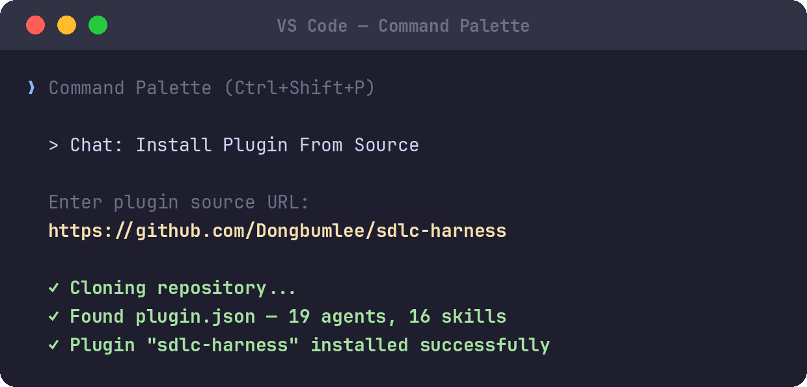
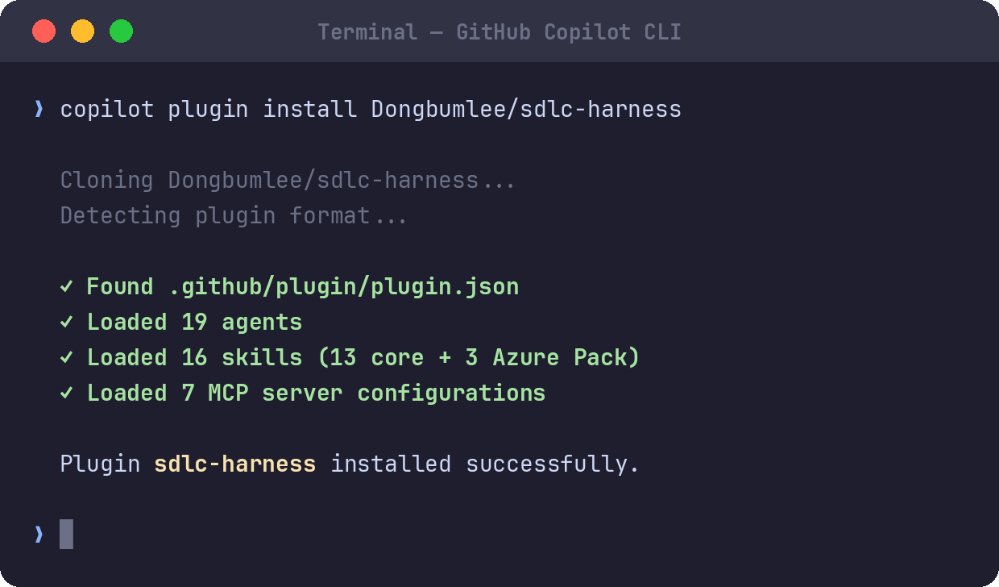
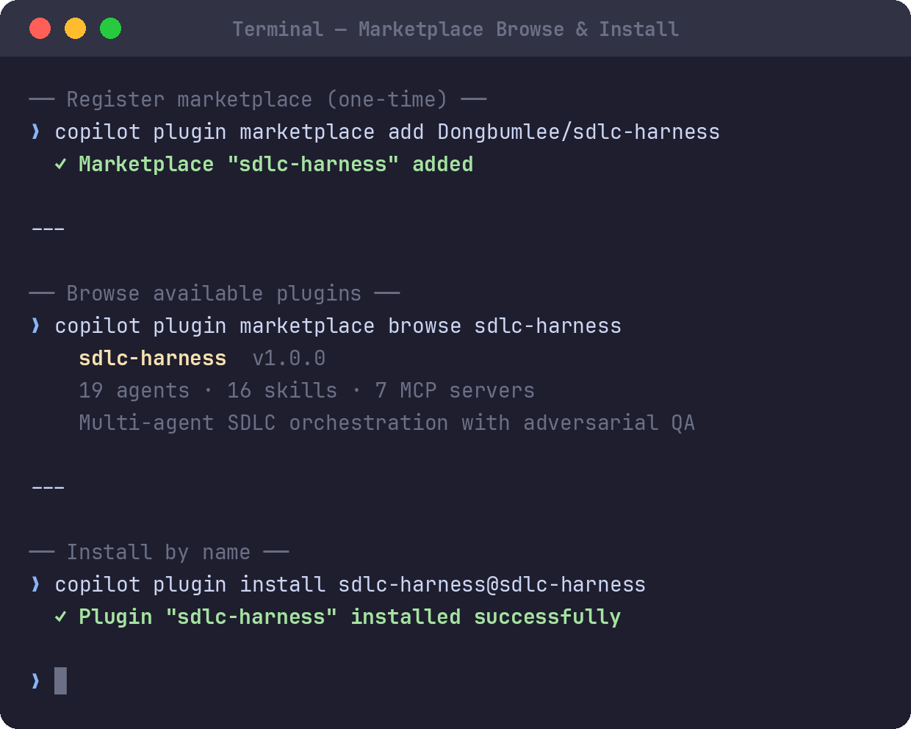
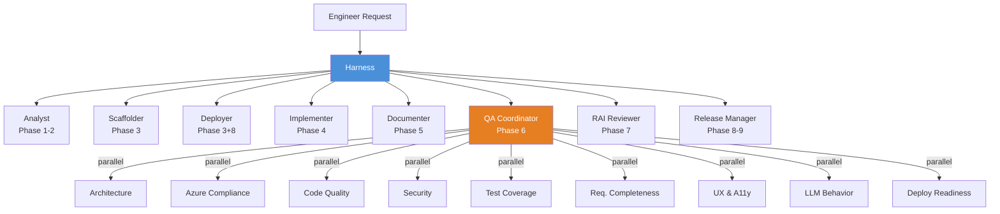

# SDLC Harness

[](https://github.com/Dongbumlee/sdlc-harness/actions/workflows/sync-check.yml)
[](LICENSE)
[](https://github.com/Dongbumlee/sdlc-harness)
[](https://code.visualstudio.com/)
[](https://docs.github.com/en/copilot/how-tos/copilot-cli)

> *From first commit to final release, Harness orchestrates your entire software development
> lifecycle — so you can focus on building what matters.*

**SDLC Harness** is a multi-agent orchestration system for GitHub Copilot that drives
software projects through 9 SDLC phases using 19 specialized AI agents. It combines
adversarial QA evaluation, live MCP-powered context, and iterative feedback loops to
deliver production-quality code with enforced development standards.

Distributed as an [Agent Plugin](#quick-start) for VS Code and GitHub Copilot CLI.
Install once — get all 19 agents, 16 skills, and the full SDLC workflow instantly.

---

## Table of Contents

- [Quick Start](#quick-start)
- [Architecture](#architecture)
- [How It Works](#how-it-works)
- [Cloud Packs](#cloud-packs)
- [Canary Testing](#canary-testing)
- [What's Included](#whats-included)
- [Prerequisites](#prerequisites)
- [Adopting in Your Repo](#adopting-in-your-repo)
- [Contributing](#contributing)

---

## Quick Start

### Install the plugin

**VS Code**



**GitHub Copilot CLI**



**Marketplace browse & install**



### First use

> [!CAUTION]
> **Two VS Code settings are required:**
>
> | Setting | Value | Why |
> |---------|-------|-----|
> | `chat.agent.defaultApproval` | `autopilot` | Without this, every tool call requires manual approval. |
> | `github.copilot.chat.virtualTools.threshold` | `0` | Harness uses 7 MCP servers (~150+ tools). The default limit hides tools. |

Open your project and bootstrap:

```
@Harness initialize workspace
```

Harness deploys MCP config, quality instructions, and prompt files, then asks for your
project details (name, domain, stack) to generate `copilot-instructions.md`.

> After Harness deploys `.vscode/mcp.json`, start the MCP servers and **open a new chat
> session** (`Ctrl+L`) — VS Code registers MCP tools at session start.

---

## Architecture

### Agent system (19 agents)

A single user-facing agent — **Harness** — orchestrates specialized workers,
each scoped to a specific SDLC phase with least-privilege tool access.



| Role | Agents | Phase |
|------|--------|-------|
| **Orchestrator** | Harness | Routes all work |
| **Phase workers** | Analyst, Scaffolder, Deployer, Implementer, Documenter, QA Coordinator, RAI Reviewer, Release Manager | 1–9 |
| **QA reviewers** (9) | Architecture, Azure Compliance, Code Quality, Security, Test Coverage, Requirements Completeness, UX/A11y, LLM Behavior, Deployment Readiness | Phase 6 |
| **Standalone** | QA Bug Checklist Reviewer | Cross-cutting |

### 9-phase SDLC workflow

| Phase | Name | Agent |
|-------|------|-------|
| 1 | Requirement Analysis | Analyst |
| 2 | Design | Analyst |
| 3 | Repo Structure & CI/CD | Scaffolder |
| 4 | Implementation & Tests | Implementer |
| 5 | Documentation | Documenter |
| 6 | QA Activities | QA Coordinator → 9 reviewers |
| 7 | Responsible AI Review | RAI Reviewer |
| 8 | Release Preparation | Release Manager |
| 9 | Publish | Release Manager |

### QA evaluation engine

Inspired by [Anthropic's harness design research](https://www.anthropic.com/engineering/harness-design-long-running-apps):

- **Generator-evaluator separation** — 9 independent reviewers run in parallel, each in its own context window with no anchoring bias.
- **Adversarial posture** — every reviewer has explicit anti-leniency instructions.
- **Numeric scoring** — each reviewer scores 1-10. Security requires ≥8, others ≥7. Any Critical finding = automatic fail.
- **Iterative loops** — QA → fix → targeted re-QA, up to 3 rounds.
- **Weighted composite** — `(security × 1.5 + sum(others)) / 8.5`. Composite < 7 = fail.

See [docs/harness-design.md](docs/harness-design.md) for the full research-to-implementation mapping.

### MCP integration (7 servers)

Agents fetch live context from external tools — no stale training data:

| Server | Purpose | Used by |
|--------|---------|---------|
| **GitHub MCP** | SDK patterns, reference repos, code search | Implementer, Scaffolder, Analyst |
| **Awesome-Copilot** | OWASP Top 10, Bicep best practices, Python standards | Security Reviewer, Deployer |
| **Azure MCP** | Validate Azure resources, manage subscriptions | Deployer, Azure Compliance Reviewer |
| **Azure DevOps MCP** | ADO wikis, pipelines, work items | QA Coordinator, Deployer |
| **Microsoft Learn MCP** | AVM module docs, Azure service documentation | Deployer, Documenter |
| **Context7** | Current framework docs (FastAPI, React, etc.) | Implementer, Analyst |
| **Playwright** | Browser automation for E2E testing | QA Coordinator |

---

## How It Works

```
@Harness Implement the order history API from ADR-012.
```

1. **Harness** identifies this as Phase 4, verifies the ADR exists, delegates to **Implementer**.
2. **Implementer** fetches live SDK patterns (GitHub MCP), loads framework docs (Context7), writes code + tests.
3. **QA Coordinator** spawns 9 reviewers in parallel — each scores 1-10 with adversarial posture.
4. If any domain fails its threshold, Harness runs an **iterative fix loop** (up to 3 rounds).
5. **Documenter** updates the ADR. **Release Manager** creates the PR.

Engineers stay in control — agents propose, engineers decide. Every subagent call is
visible in Chat as a collapsible tool call.

See [docs/workflow-guide.md](docs/workflow-guide.md) for the full step-by-step walkthrough with sequence diagrams.

---

## Cloud Packs

Cloud Packs are modular skill sets for specific cloud platforms. Each pack adds
deployment, data access, and storage skills tailored to that provider.

| Pack | Skills | Status |
|------|--------|--------|
| **Azure** | `sdlc-azure-deployment`, `sdlc-cosmos-repository`, `sdlc-blob-storage` | Included |
| **AWS** | `sdlc-aws-deployment`, `sdlc-dynamodb-repository`, `sdlc-s3-storage` | Planned |
| **GCP** | `sdlc-gcp-deployment`, `sdlc-firestore-repository`, `sdlc-gcs-storage` | Planned |

The Azure Pack is bundled at `packs/azure/` and includes its own `pack.json` manifest.
To create a new cloud pack, use the `packs/_template/` skeleton.

---

## Canary Testing

SDLC Harness includes an E2E test framework for validating the harness itself.
Canary specs define expected agent behavior for each SDLC phase.

- **11 canary specs** across `bench/canaries/` (one per phase + catalog-specific tests)
- **6 JSON schemas** in `schemas/` for validation (canary specs, configs, reports, cloud packs)
- **CI integration** — `canary-test.yml` validates spec schema on PRs touching agents/skills
- Results stored as structured JSON in `bench/results/`

```bash
# Validate canary specs locally
python tools/validate_canaries.py
```

---

## What's Included

### Agents (19)

| Agent | Description |
|-------|-------------|
| **Harness** | Orchestrator — routes all SDLC work |
| **Analyst** | Phase 1-2: Requirements & design |
| **Scaffolder** | Phase 3: Repo structure from templates |
| **Deployer** | Phase 3+8: Azure infrastructure (Bicep/AVM) |
| **Implementer** | Phase 4: Production code + tests |
| **Documenter** | Phase 5: ADRs, API docs |
| **QA Coordinator** | Phase 6: Dispatches 9 parallel reviewers |
| **RAI Reviewer** | Phase 7: Responsible AI assessment |
| **Release Manager** | Phase 8-9: Changelog, PR, publish |
| **Architecture Reviewer** | QA: Layering, dependency boundaries |
| **Azure Compliance Reviewer** | QA: SDK usage, AVM, identity |
| **Code Quality Reviewer** | QA: Naming, docstrings, dead code |
| **Security Reviewer** | QA: OWASP, secrets, auth |
| **Test Coverage Reviewer** | QA: Tests, coverage, assertions |
| **Requirements Completeness Reviewer** | QA: All requirements addressed |
| **UX & Accessibility Reviewer** | QA: ARIA, keyboard nav, a11y |
| **LLM Behavior Reviewer** | QA: Prompt safety, grounding, citations |
| **Deployment Readiness Reviewer** | QA: Error handling, perf, observability |
| **QA Bug Checklist Reviewer** | Standalone: 338 real bug patterns |

### Skills (16)

| Skill | Purpose |
|-------|---------|
| `sdlc-workspace-init` | Bootstrap workspace (MCP config, instructions, prompts) |
| `sdlc-project-scaffolding` | Scaffold projects from templates |
| `sdlc-project-manifest` | Cross-agent consistency manifest |
| `sdlc-reference-catalog` | Living catalog of approved libraries |
| `sdlc-adr-authoring` | Architecture Decision Records |
| `sdlc-requirements-discovery` | Requirements elicitation |
| `sdlc-architecture-review` | Architecture review checklist |
| `sdlc-code-quality` | Code quality review checklist |
| `sdlc-security-review` | OWASP + Azure security patterns |
| `sdlc-project-qa` | Comprehensive product QA checklist |
| `sdlc-qa-bug-checklist` | 338 real production bug patterns |
| `sdlc-reviewer-output-format` | Structured YAML output for reviewers |
| `sdlc-canary-runner` | E2E canary test runner |
| `sdlc-azure-deployment` | Azure Pack: Bicep/AVM deployment |
| `sdlc-cosmos-repository` | Azure Pack: Cosmos DB Repository Pattern |
| `sdlc-blob-storage` | Azure Pack: Blob Storage + Queue operations |

### Quality instructions (14 files, auto-applied by file type)

| Language | Code quality | Test quality |
|----------|-------------|-------------|
| Python | `code-quality-py` | `test-quality` |
| TypeScript | `code-quality-ts` | `test-quality-ts` |
| React/TSX | `code-quality-tsx` | `test-quality-tsx` |
| C# | `code-quality-csharp` | `test-quality-csharp` |
| Java | `code-quality-java` | `test-quality-java` |
| Go | `code-quality-go` | `test-quality-go` |
| Rust | `code-quality-rust` | `test-quality-rust` |

### Prompt files (6)

| Prompt | Phase | Routes to |
|--------|-------|-----------|
| `requirement-and-design` | 1-2 | Analyst |
| `repo-structure-and-cicd` | 3 | Scaffolder |
| `deployment` | 3+8 | Deployer |
| `implementation-and-tests` | 4 | Implementer |
| `repo-documentation` | 5 | Documenter |
| `qa-rai-release` | 6-8 | Harness |

---

## Prerequisites

| Tool | Version | Purpose |
|------|---------|---------|
| **VS Code** | latest | Primary IDE |
| **GitHub Copilot** + **Copilot Chat** | latest | Required extensions |
| **Python** | 3.12+ | Primary language for templates |
| **uv** | latest | Python package manager |
| **Docker** | latest | Container builds, MCP servers |
| **Git** | 2.40+ | Version control |
| **Azure CLI** | latest | Azure resource management |
| **Azure Developer CLI** | 1.18.2+ | `azd up` provisioning |
| **Bicep CLI** | latest | Infrastructure-as-Code |

Conditional: **Node.js 20+** / **pnpm** for TypeScript/React projects.

---

## Adopting in Your Repo

### Option A: Plugin install (recommended)

```bash
copilot plugin install Dongbumlee/sdlc-harness
```

Then open any project and run:

```
@Harness initialize workspace
```

Harness generates `copilot-instructions.md`, deploys quality instructions and prompt files.

### Option B: Manual copy

1. Copy `.github/plugin/agents/`, `.github/prompts/`, `.github/instructions/`, `.design/`, `.vscode/mcp.json`
2. Set `<PROJECT_NAME>` in `.github/copilot-instructions.md`
3. Select quality instruction files matching your stack

### Adoption checklist

- [ ] Install plugin or copy files
- [ ] Run `@Harness` or `/sdlc-workspace-init` to generate workspace files
- [ ] Review `.github/copilot-instructions.md`
- [ ] Start MCP servers, open new chat session
- [ ] Enable branch protection on `main`

---

## Contributing

SDLC Harness development happens on the `evo` branch.

### Repository structure

```
.github/plugin/       ← Repo-scoped plugin (auto-loads when repo is opened)
vscode-extension/     ← VSIX distribution (must stay in sync with .github/plugin/)
bench/canaries/       ← E2E canary test specs
schemas/              ← JSON schemas for validation
tools/                ← Validation scripts
docs/                 ← Architecture docs, specs, guides
```

### CI checks

| Workflow | Purpose |
|----------|---------|
| `sync-check.yml` | Ensures `.github/plugin/` and `vscode-extension/` stay identical |
| `canary-test.yml` | Validates canary spec schema on PRs touching agents/skills |
| `build-vsix.yml` | Builds the VS Code extension package |

### Key rules

- `.github/plugin/` and `vscode-extension/` must stay in sync (CI enforced)
- Agent/skill changes require corresponding canary spec updates
- All QA reviewers emit structured YAML output (see `sdlc-reviewer-output-format` skill)

---

## License

MIT
