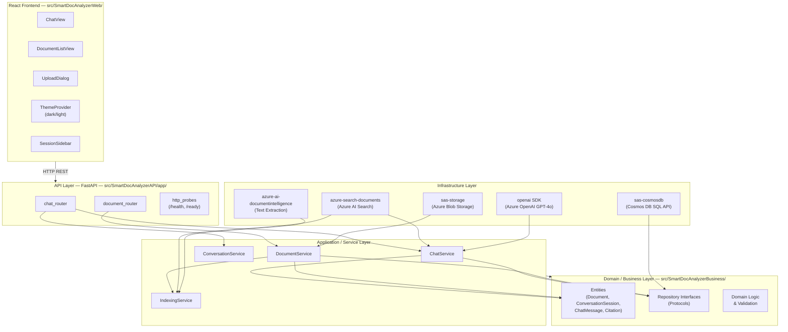
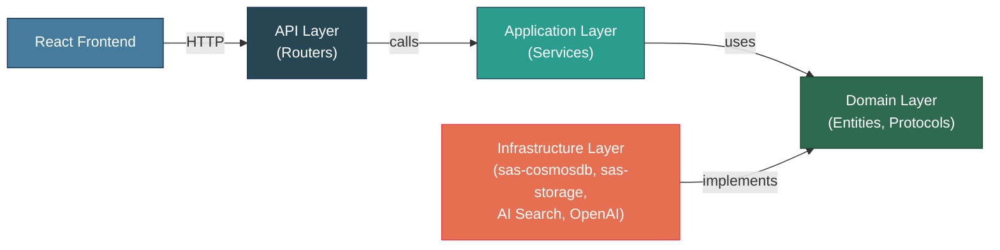
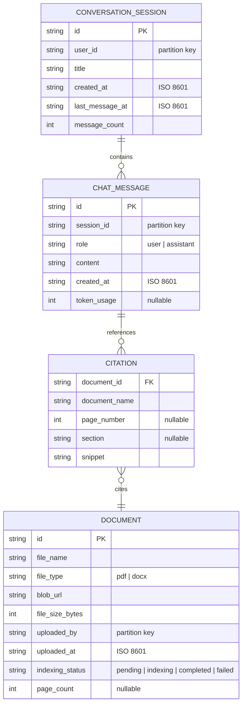
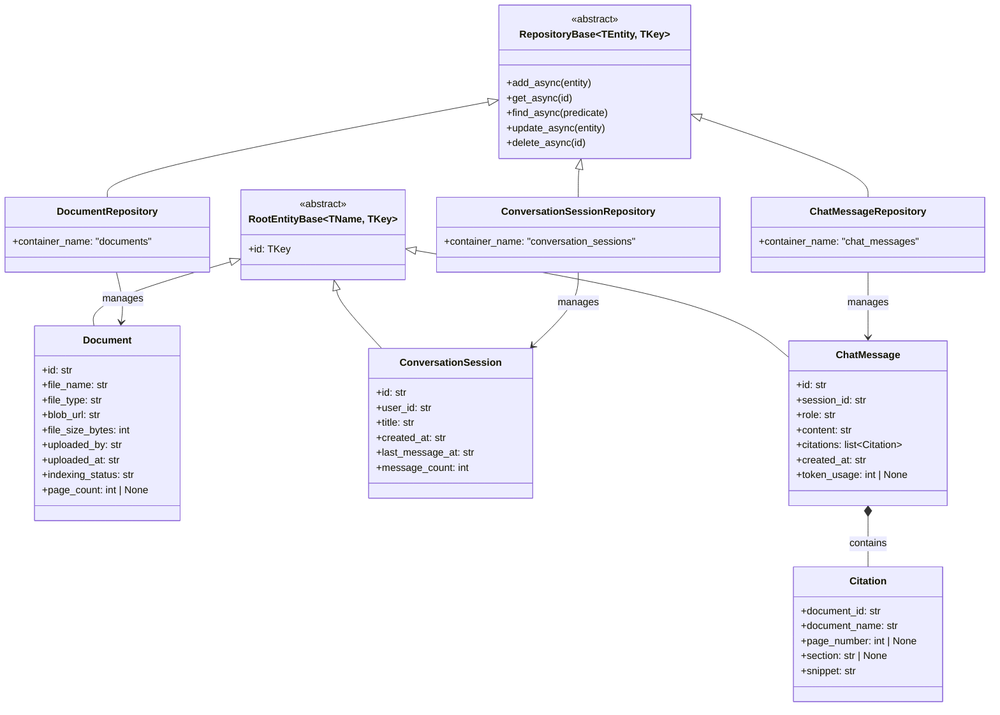
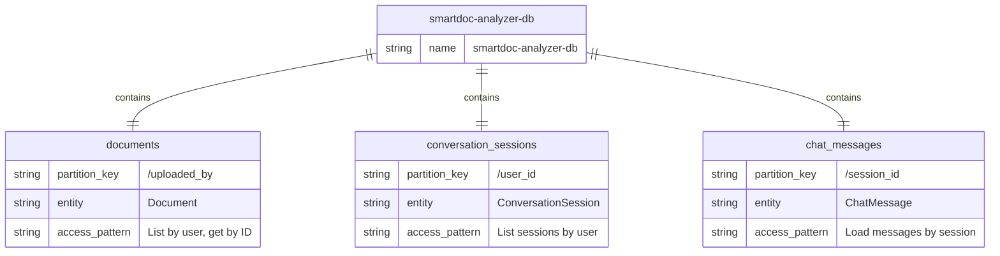
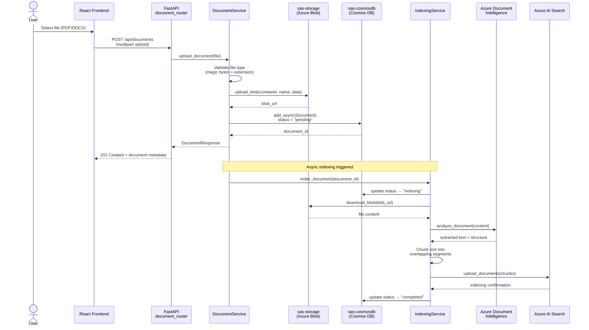
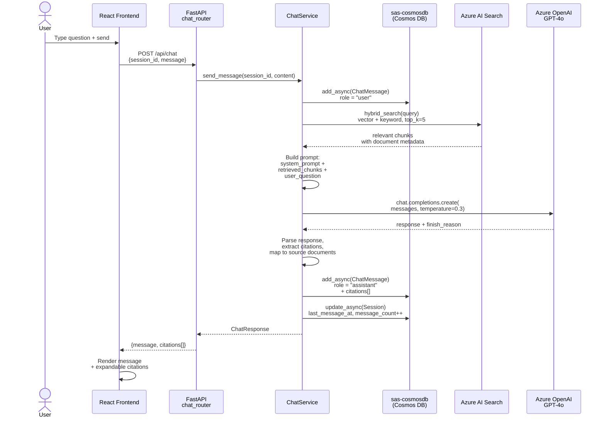
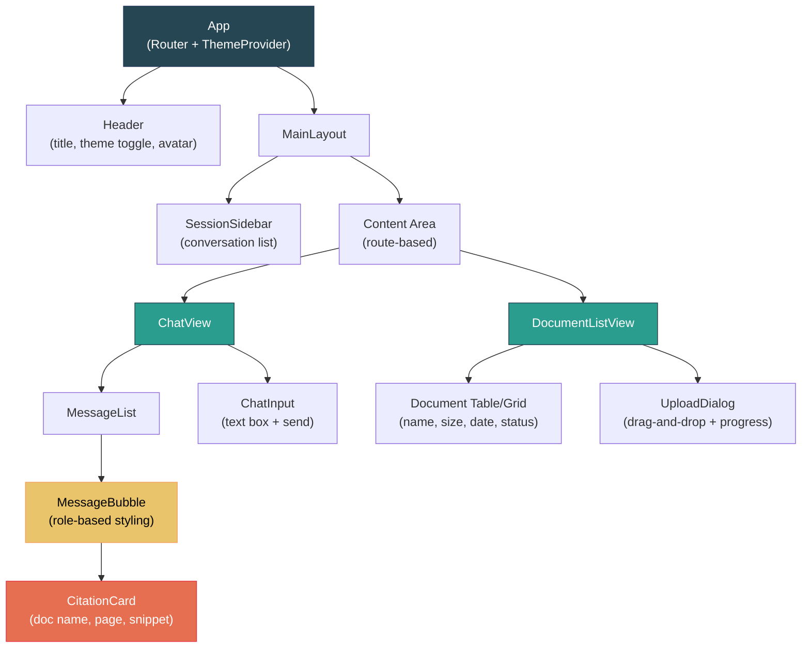

# ADR-001: SmartDoc Analyzer Architecture

> **Status:** Accepted
> **SDLC Phase:** 1-2 (Requirements & Design)
> **Date:** 2026-04-05
> **Author:** @Sassy (Analyst Agent)

---

## Context

Enterprise knowledge workers need a tool to upload documents (PDF, DOCX), search across them using natural language, and receive AI-generated answers with citations. Current workflows involve manual searching across scattered files, leading to wasted time and missed insights. SmartDoc Analyzer addresses this by combining Azure AI Search (RAG) with Azure OpenAI GPT-4o to deliver a conversational document analysis experience.

---

## Problem / Requirements

### Functional Requirements

- **FR-1**: Upload PDF and DOCX documents to Azure Blob Storage via a REST API
- **FR-2**: Automatically index uploaded documents using Azure AI Search for RAG retrieval
- **FR-3**: Provide a chat interface powered by Azure OpenAI GPT-4o that answers questions grounded in uploaded documents
- **FR-4**: Return citations (document name, page/section) alongside AI-generated answers
- **FR-5**: Store conversation history (sessions, messages) in Azure Cosmos DB
- **FR-6**: React frontend with dark/light theme toggle
- **FR-7**: List uploaded documents with metadata (name, size, upload date, indexing status)

### Non-Functional Requirements

- **NFR-1**: Support up to 50 concurrent users with < 2s response time for chat queries
- **NFR-2**: Support document uploads up to 100 MB per file
- **NFR-3**: Azure AD / Microsoft Entra ID authentication for all users
- **NFR-4**: WCAG 2.1 AA accessibility in the frontend
- **NFR-5**: Horizontal scalability via Azure Container Apps
- **NFR-6**: Observability — structured logging, request correlation IDs, health probes

### Constraints

- Must use `sas-cosmosdb` for Cosmos DB access (no raw `azure-cosmos`)
- Must use `sas-storage` for Blob Storage access (no raw `azure-storage-blob`)
- Python 3.12+ for backend, React 18 + TypeScript 5 for frontend
- All source code under `src/<ProjectName><Layer>/`
- FastAPI backend scaffolded from `python_api_application_template`

---

## Design / Implementation

### Architecture

#### Layered Architecture Overview



#### Dependency Rules



| Rule | Direction |
|---|---|
| API → Application → Domain | Routers call services, services use domain models |
| Infrastructure → Domain | Repositories implement domain interfaces |
| Domain has NO outward dependencies | Pure models, business rules, protocols |
| Web → API | React calls FastAPI via HTTP only |

### Azure Services

| Service | Library | Purpose |
|---|---|---|
| Azure Cosmos DB (SQL API) | `sas-cosmosdb` (PyPI) | Conversation history, user sessions, document metadata |
| Azure Blob Storage | `sas-storage` (PyPI) | Document storage (PDF/DOCX) |
| Azure AI Search | `azure-search-documents` | Document indexing and RAG retrieval |
| Azure OpenAI Service | `openai` (with Azure config) | GPT-4o chat completions with citations |
| Azure AI Document Intelligence | `azure-ai-documentintelligence` | PDF/DOCX text extraction for indexing |
| Microsoft Entra ID | `azure-identity` | Authentication (DefaultAzureCredential) |
| Azure Container Apps | — (infra only) | Hosting backend + frontend |
| Azure Key Vault | `azure-keyvault-secrets` | Secrets management |
| Azure App Configuration | (via template) | Feature flags, dynamic config |

### Template Mapping

| Layer | Project Path | Template | Code Root |
|---|---|---|---|
| **API** | `src/SmartDocAnalyzerAPI/` | `python_api_application_template` | `app/` |
| **Business** | `src/SmartDocAnalyzerBusiness/` | `python_application_template` | `src/` |
| **Web** | `src/SmartDocAnalyzerWeb/` | React + TypeScript (Vite) | `src/` |

### Data Model

#### Entity Relationship Diagram



#### Entity Class Diagram



#### Entity Definitions (Domain Layer — `src/SmartDocAnalyzerBusiness/src/libs/`)

**`Document` Entity**

```python
from sas.cosmosdb.sql import RootEntityBase

class Document(RootEntityBase["Document", str]):
    """Uploaded document metadata."""
    file_name: str
    file_type: str  # "pdf" | "docx"
    blob_url: str
    file_size_bytes: int
    uploaded_by: str
    uploaded_at: str  # ISO 8601
    indexing_status: str  # "pending" | "indexing" | "completed" | "failed"
    page_count: int | None = None
```

**`ConversationSession` Entity**

```python
class ConversationSession(RootEntityBase["ConversationSession", str]):
    """A chat session belonging to a user."""
    user_id: str  # partition key
    title: str
    created_at: str
    last_message_at: str
    message_count: int = 0
```

**`ChatMessage` Entity**

```python
from pydantic import BaseModel

class Citation(BaseModel):
    """A citation referencing a source document."""
    document_id: str
    document_name: str
    page_number: int | None = None
    section: str | None = None
    snippet: str

class ChatMessage(RootEntityBase["ChatMessage", str]):
    """A single message in a conversation."""
    session_id: str  # partition key
    role: str  # "user" | "assistant"
    content: str
    citations: list[Citation] = []
    created_at: str
    token_usage: int | None = None
```

#### Repository Definitions (Domain Layer)

```python
from sas.cosmosdb.sql import RepositoryBase

class DocumentRepository(RepositoryBase[Document, str]):
    def __init__(self, connection_string: str, database_name: str):
        super().__init__(
            connection_string=connection_string,
            database_name=database_name,
            container_name="documents"
        )

class ConversationSessionRepository(RepositoryBase[ConversationSession, str]):
    def __init__(self, connection_string: str, database_name: str):
        super().__init__(
            connection_string=connection_string,
            database_name=database_name,
            container_name="conversation_sessions"
        )

class ChatMessageRepository(RepositoryBase[ChatMessage, str]):
    def __init__(self, connection_string: str, database_name: str):
        super().__init__(
            connection_string=connection_string,
            database_name=database_name,
            container_name="chat_messages"
        )
```

#### Cosmos DB Container Design



| Container | Partition Key | Entity | Access Pattern |
|---|---|---|---|
| `documents` | `/uploaded_by` | Document | List by user, get by ID |
| `conversation_sessions` | `/user_id` | ConversationSession | List sessions by user |
| `chat_messages` | `/session_id` | ChatMessage | Load messages by session |

### API Endpoints

| Method | Path | Description |
|---|---|---|
| `POST` | `/api/documents` | Upload a document (multipart) |
| `GET` | `/api/documents` | List user's documents |
| `GET` | `/api/documents/{id}` | Get document detail |
| `DELETE` | `/api/documents/{id}` | Delete a document |
| `POST` | `/api/chat` | Send message and get AI response with citations |
| `GET` | `/api/sessions` | List conversation sessions |
| `POST` | `/api/sessions` | Create a new session |
| `DELETE` | `/api/sessions/{id}` | Delete a session |
| `GET` | `/health` | Liveness probe |
| `GET` | `/ready` | Readiness probe |

### Backend Services (Application Layer)

| Service | Responsibility |
|---|---|
| `DocumentService` | Upload to Blob Storage (sas-storage), save metadata to Cosmos DB, trigger indexing |
| `IndexingService` | Extract text via Document Intelligence, push to Azure AI Search index |
| `ChatService` | Retrieve relevant docs from AI Search, call GPT-4o, persist messages, return citations |
| `ConversationService` | CRUD for sessions — create, list, delete, rename |

### Frontend Components (React + TypeScript)

| Component | Purpose |
|---|---|
| `App` | Root layout, routing, theme provider |
| `ThemeProvider` | Dark/light mode toggle with system preference detection |
| `ChatView` | Chat interface with message list, input box, citation display |
| `MessageBubble` | Single message with role-based styling and expandable citations |
| `CitationCard` | Document reference with name, page, snippet preview |
| `DocumentListView` | Table/grid of uploaded documents with status indicators |
| `UploadDialog` | Drag-and-drop file upload with progress bar |
| `SessionSidebar` | Conversation history list with create/delete/rename |
| `Header` | App title, theme toggle, user avatar |

### Document Processing Pipeline



### Chat Flow (RAG)



### Frontend Component Architecture



### Security Considerations

| Area | Approach |
|---|---|
| **Authentication** | Microsoft Entra ID (MSAL) — frontend acquires tokens, backend validates JWT via FastAPI middleware |
| **Authorization** | User can only access own documents and conversations (partition key = user_id) |
| **Secrets** | Azure Key Vault for all connection strings, API keys. No secrets in env vars or code |
| **Data at rest** | Cosmos DB + Blob Storage encryption enabled by default (Azure-managed keys) |
| **Data in transit** | TLS 1.2+ enforced on all endpoints |
| **Input validation** | Pydantic models validate all API inputs; file type allowlist (PDF/DOCX only) |
| **File upload safety** | Validate file headers (magic bytes), enforce size limits, content-type verification |
| **Prompt injection** | System prompt grounding — instruct GPT-4o to only answer from retrieved documents, not general knowledge |
| **CORS** | Restrict to frontend origin only |
| **Rate limiting** | Per-user rate limits on chat and upload endpoints |

---

## Alternatives Considered

### Alternative 1: Raw Azure SDK instead of sas-cosmosdb / sas-storage

- **Pros:** Direct control, no library dependency
- **Cons:** More boilerplate, no Repository Pattern, inconsistent with GSA standards
- **Rejected because:** Reference catalog mandates sas-cosmosdb and sas-storage

### Alternative 2: LangChain for RAG orchestration

- **Pros:** Rich ecosystem, many integrations
- **Cons:** Heavy dependency, abstractions can obscure Azure-specific tuning, not in reference catalog
- **Rejected because:** Direct Azure AI Search + OpenAI SDK gives better control and aligns with GSA patterns. Simpler dependency chain.

### Alternative 3: Cosmos DB MongoDB API instead of SQL API

- **Pros:** Familiar MongoDB query syntax
- **Cons:** SQL API has richer integration with Azure ecosystem, sas-cosmosdb supports both
- **Rejected because:** SQL API is the standard for new GSA projects; better indexing control

### Alternative 4: Next.js full-stack instead of React SPA + FastAPI

- **Pros:** SSR, single deployment, built-in API routes
- **Cons:** All approved templates are Python-based; would lose FastAPI DI patterns, sas-cosmosdb/sas-storage Python libraries
- **Rejected because:** Python backend is required for approved library usage; separate API + SPA aligns with template structure

---

## Testing Strategy

- **Unit tests:** pytest for all services (ChatService, DocumentService, IndexingService, ConversationService). Mock Cosmos DB repos and Blob Storage helpers.
- **Integration tests:** HTTP-level tests against FastAPI using `httpx.AsyncClient`. Test upload, chat, and session flows end-to-end with test containers.
- **Frontend tests:** Vitest + React Testing Library for component behavior. MSW (Mock Service Worker) for API mocking.
- **Manual testing:** Upload various PDF/DOCX sizes, verify citation accuracy, test dark/light mode, test auth flow.

---

## RAI / Risk Considerations

- [x] **Prompt injection risks assessed** — System prompt instructs GPT-4o to answer only from retrieved documents. User input is never injected into system prompt.
- [x] **Data privacy impact reviewed** — Documents stored per-user with partition-level isolation. No cross-user data leakage in search results (security filters on AI Search).
- [x] **Hallucination mitigation** — Citations required; frontend displays "No sources found" when AI Search returns no relevant chunks.
- [ ] **Bias considerations** — To be reviewed based on document corpus characteristics.

---

## SDLC Impact by Phase

| Phase | Impact |
|---|---|
| 1-2: Requirements & Design | This ADR |
| 3: Repo Structure & CI/CD | Scaffold 3 projects (API, Business, Web) + ADO pipeline |
| 4: Implementation & Tests | Implement services, entities, repos, routers, React components |
| 5: Documentation | API docs (OpenAPI), README, architecture diagrams |
| 6: QA Activities | 8-reviewer QA pass + manual QA checklist |
| 7: RAI Review | Prompt safety, data isolation, hallucination controls |
| 8-9: Release & Publish | Release script, PR to main |

---

## Open Questions

- [ ] Should document indexing be synchronous (wait for completion) or asynchronous (queue-based with status polling)?
- [ ] Maximum number of documents per user?
- [ ] Should the chat support streaming responses (SSE) from GPT-4o?
- [ ] Multi-language document support requirements?
- [ ] Retention policy for conversation history?

---

## References

- Design proposal: [outputs/step-1-design-proposal.md](../../outputs/step-1-design-proposal.md)
- Reference catalog: [.github/reference-catalog.md](../../.github/reference-catalog.md)
- ADR template: [.design/ADR-TEMPLATE.md](../../.design/ADR-TEMPLATE.md)
- sas-cosmosdb: [mcaps-microsoft/python_cosmosdb_helper](https://github.com/mcaps-microsoft/python_cosmosdb_helper)
- sas-storage: [mcaps-microsoft/python_storageaccount_helper](https://github.com/mcaps-microsoft/python_storageaccount_helper)
- API template: [mcaps-microsoft/python_api_application_template](https://github.com/mcaps-microsoft/python_api_application_template)
