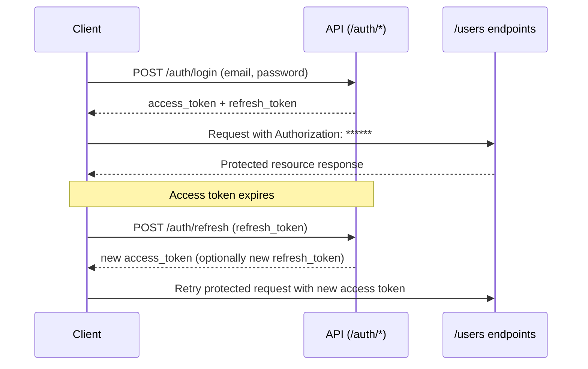

# API Documentation: User Management REST API

> **Base URL:** `https://api.example.com/v1`  
> **Authentication:** JWT `Bearer` token (issued by `POST /auth/login`)  
> **Date:** 2026-09-16  
> **Versioning:** URL path prefix (`/v1/`)

---

## Overview

This API manages authentication and user lifecycle operations:
- Login and access-token refresh
- User CRUD (with soft delete)
- Avatar upload

All responses use a JSON envelope:

```json
{
  "data": {},
  "meta": {},
  "errors": []
}
```

---

## Getting Started

1. **Get credentials** (API key and user credentials) from your platform administrator.
2. **Authenticate** using `POST /auth/login` to obtain JWT tokens.
3. **Call protected endpoints** with:
   - `Authorization: ******
   - `X-Request-ID: <uuid>`

First request:

```bash
curl -X POST "https://api.example.com/v1/auth/login" \
  -H "Content-Type: application/json" \
  -H "X-Request-ID: 1f3ea8ec-6b7e-4587-b667-8965e0e1e2a2" \
  -d '{
    "email": "admin@example.com",
    "password": "<example-password>"
  }'
```

---

## Authentication

Protected endpoints require:

```http
Authorization: ******
```

### Authentication flow



---

## Global Request Headers

| Header | Required | Description |
|---|---|---|
| `Authorization` | Yes (except `/auth/login`) | JWT bearer token |
| `Content-Type` | Yes for JSON bodies; `multipart/form-data` for avatar upload | Request media type |
| `X-Request-ID` | Recommended | Client-generated request correlation ID (UUID) |

---

## Rate Limiting

- **100 requests/minute per API key**
- **1000 requests/hour per API key**

Recommended handling:
- Watch `429 Too Many Requests`
- Respect `Retry-After` header if present
- Implement exponential backoff + jitter

---

## Endpoints

### 1) `POST /auth/login`

Authenticate user and issue tokens.

**Path/query parameters:** None

**Request headers**

| Header | Required | Value |
|---|---|---|
| `Authorization` | No | Not required for login |
| `Content-Type` | Yes | `application/json` |
| `X-Request-ID` | Recommended | UUID string |

**Request body schema**

| Field | Type | Required | Validation |
|---|---|---|---|
| `email` | string | Yes | Valid email, max 254 chars |
| `password` | string | Yes | 8-128 chars |

**Example request**

```json
{
  "email": "admin@example.com",
  "password": "<example-password>"
}
```

**Success response** `200 OK`

```json
{
  "data": {
    "access_token": "******",
    "refresh_token": "<example-refresh-token>",
    "token_type": "Bearer",
    "expires_in": 3600,
    "refresh_expires_in": 2592000
  },
  "meta": {
    "request_id": "1f3ea8ec-6b7e-4587-b667-8965e0e1e2a2",
    "timestamp": "2026-09-16T04:00:00Z"
  },
  "errors": []
}
```

**Error responses (examples)**

| Status | Example |
|---|---|
| 400 | `{"data":null,"meta":{"request_id":"..."},"errors":[{"code":"BAD_REQUEST","message":"Malformed JSON body."}]}` |
| 401 | `{"data":null,"meta":{"request_id":"..."},"errors":[{"code":"INVALID_CREDENTIALS","message":"Email or password is incorrect."}]}` |
| 403 | `{"data":null,"meta":{"request_id":"..."},"errors":[{"code":"ACCOUNT_LOCKED","message":"Account is temporarily locked."}]}` |
| 404 | `{"data":null,"meta":{"request_id":"..."},"errors":[{"code":"NOT_FOUND","message":"Authentication endpoint not found."}]}` |
| 409 | `{"data":null,"meta":{"request_id":"..."},"errors":[{"code":"CONFLICT","message":"Concurrent login policy conflict."}]}` |
| 422 | `{"data":null,"meta":{"request_id":"..."},"errors":[{"code":"VALIDATION_ERROR","message":"email must be a valid email address.","field":"email"}]}` |
| 429 | `{"data":null,"meta":{"request_id":"..."},"errors":[{"code":"RATE_LIMITED","message":"Rate limit exceeded. Retry later."}]}` |
| 500 | `{"data":null,"meta":{"request_id":"..."},"errors":[{"code":"INTERNAL_ERROR","message":"Unexpected server error."}]}` |

**curl**

```bash
curl -X POST "https://api.example.com/v1/auth/login" \
  -H "Content-Type: application/json" \
  -H "X-Request-ID: 1f3ea8ec-6b7e-4587-b667-8965e0e1e2a2" \
  -d '{"email":"admin@example.com","password":"<example-password>"}'
```

**Python (httpx)**

```python
import httpx

payload = {"email": "admin@example.com", "password": "<example-password>"}
headers = {"Content-Type": "application/json", "X-Request-ID": "1f3ea8ec-6b7e-4587-b667-8965e0e1e2a2"}

with httpx.Client(base_url="https://api.example.com/v1", timeout=10.0) as client:
    resp = client.post("/auth/login", json=payload, headers=headers)
    resp.raise_for_status()
    tokens = resp.json()["data"]
```

---

### 2) `POST /auth/refresh`

Exchange a refresh token for a new access token.

**Path/query parameters:** None

**Request headers**

| Header | Required | Value |
|---|---|---|
| `Authorization` | No | Not required when refresh token is in body |
| `Content-Type` | Yes | `application/json` |
| `X-Request-ID` | Recommended | UUID string |

**Request body schema**

| Field | Type | Required | Validation |
|---|---|---|---|
| `refresh_token` | string | Yes | UUID/string token; non-empty |

**Success response** `200 OK`

```json
{
  "data": {
    "access_token": "new-access-token...",
    "token_type": "Bearer",
    "expires_in": 3600
  },
  "meta": {
    "request_id": "c0e7b4d4-c8c9-4be5-b33a-baf9032ec9f9",
    "timestamp": "2026-09-16T04:00:05Z"
  },
  "errors": []
}
```

**Error responses:** same status set and envelope pattern as `/auth/login` (400, 401, 403, 404, 409, 422, 429, 500), with endpoint-specific messages such as `REFRESH_TOKEN_EXPIRED` or `REFRESH_TOKEN_REVOKED`.
Examples: see [Standard Error Examples by Status](#standard-error-examples-by-status).

**curl**

```bash
curl -X POST "https://api.example.com/v1/auth/refresh" \
  -H "Content-Type: application/json" \
  -H "X-Request-ID: c0e7b4d4-c8c9-4be5-b33a-baf9032ec9f9" \
  -d '{"refresh_token":"<example-refresh-token>"}'
```

**Python (httpx)**

```python
import httpx

headers = {"Content-Type": "application/json", "X-Request-ID": "c0e7b4d4-c8c9-4be5-b33a-baf9032ec9f9"}
payload = {"refresh_token": "<example-refresh-token>"}

with httpx.Client(base_url="https://api.example.com/v1") as client:
    resp = client.post("/auth/refresh", json=payload, headers=headers)
    resp.raise_for_status()
    new_access_token = resp.json()["data"]["access_token"]
```

---

### 3) `GET /users`

List users with filtering, sorting, and pagination.

**Query parameters**

| Parameter | Type | Required | Validation | Description |
|---|---|---|---|---|
| `page` | integer | No | `>=1`, default `1` | Offset page number |
| `per_page` | integer | No | `1-100`, default `20` | Items per page |
| `role` | string | No | `admin`, `manager`, `member` | Filter by role |
| `status` | string | No | `active`, `inactive`, `pending` | Filter by status |
| `created_after` | string (date-time) | No | ISO 8601 | Filter by creation timestamp |
| `sort_by` | string | No | `name`, `email`, `created_at`, `updated_at` | Sort field |
| `order` | string | No | `asc` or `desc`, default `asc` | Sort direction |

**Request headers**

| Header | Required | Value |
|---|---|---|
| `Authorization` | Yes | `******` |
| `Content-Type` | Yes | `application/json` |
| `X-Request-ID` | Recommended | UUID string |

**Request body schema:** None

**Success response** `200 OK`

```json
{
  "data": [
    {
      "id": "usr_01J9G63Q0K0Y3M9BW6A3",
      "name": "Alice Smith",
      "email": "alice@example.com",
      "role": "admin",
      "status": "active",
      "avatar_url": "https://cdn.example.com/avatars/usr_01J9G63Q0K0Y3M9BW6A3.png",
      "created_at": "2026-01-10T10:15:00Z",
      "updated_at": "2026-09-10T07:45:00Z",
      "deleted_at": null
    }
  ],
  "meta": {
    "page": 1,
    "per_page": 20,
    "total_items": 145,
    "total_pages": 8,
    "request_id": "d6f37f72-e64f-4734-9a69-f0f67ec77ce5"
  },
  "errors": []
}
```

**Error responses:** 400, 401, 403, 404, 409, 422, 429, 500 using standard envelope (for example, `422` when `sort_by` is unsupported).
Examples: see [Standard Error Examples by Status](#standard-error-examples-by-status).

**curl**

```bash
curl -X GET "https://api.example.com/v1/users?page=1&per_page=20&role=admin&status=active&sort_by=created_at&order=desc" \
  -H "Authorization: ******" \
  -H "Content-Type: application/json" \
  -H "X-Request-ID: d6f37f72-e64f-4734-9a69-f0f67ec77ce5"
```

**Python (httpx)**

```python
import httpx

headers = {
    "Authorization": "******",
    "Content-Type": "application/json",
    "X-Request-ID": "d6f37f72-e64f-4734-9a69-f0f67ec77ce5",
}
params = {
    "page": 1,
    "per_page": 20,
    "role": "admin",
    "status": "active",
    "sort_by": "created_at",
    "order": "desc",
}

with httpx.Client(base_url="https://api.example.com/v1") as client:
    resp = client.get("/users", params=params, headers=headers)
    resp.raise_for_status()
    users = resp.json()["data"]
```

---

### 4) `POST /users`

Create a new user.

**Request headers**

| Header | Required | Value |
|---|---|---|
| `Authorization` | Yes | `******` |
| `Content-Type` | Yes | `application/json` |
| `X-Request-ID` | Recommended | UUID string |

**Request body schema**

| Field | Type | Required | Validation |
|---|---|---|---|
| `name` | string | Yes | 1-100 chars |
| `email` | string | Yes | Valid email; unique |
| `role` | string | Yes | `admin`, `manager`, `member` |
| `password` | string | Yes | 8-128 chars; at least 1 upper, 1 lower, 1 digit, 1 symbol |

**Success response** `201 Created`

```json
{
  "data": {
    "id": "usr_01J9G6A5Y8M6ZX8D6GS2",
    "name": "Bob Lee",
    "email": "bob.lee@example.com",
    "role": "member",
    "status": "active",
    "avatar_url": null,
    "created_at": "2026-09-16T04:00:10Z",
    "updated_at": "2026-09-16T04:00:10Z",
    "deleted_at": null
  },
  "meta": {
    "request_id": "4483f1ad-2f57-44a4-9880-6d13018bf90f"
  },
  "errors": []
}
```

**Error responses:** 400, 401, 403, 404, 409 (email already exists), 422 (validation), 429, 500.
Examples: see [Standard Error Examples by Status](#standard-error-examples-by-status).

**curl**

```bash
curl -X POST "https://api.example.com/v1/users" \
  -H "Authorization: ******" \
  -H "Content-Type: application/json" \
  -H "X-Request-ID: 4483f1ad-2f57-44a4-9880-6d13018bf90f" \
  -d '{
    "name":"Bob Lee",
    "email":"bob.lee@example.com",
    "role":"member",
    "password":"MyS3cureP@ss!"
  }'
```

**Python (httpx)**

```python
import httpx

headers = {
    "Authorization": "******",
    "Content-Type": "application/json",
    "X-Request-ID": "4483f1ad-2f57-44a4-9880-6d13018bf90f",
}
payload = {
    "name": "Bob Lee",
    "email": "bob.lee@example.com",
    "role": "member",
    "password": "MyS3cureP@ss!",
}

with httpx.Client(base_url="https://api.example.com/v1") as client:
    resp = client.post("/users", json=payload, headers=headers)
    resp.raise_for_status()
    created = resp.json()["data"]
```

---

### 5) `GET /users/{id}`

Retrieve one user by ID.

**Path parameters**

| Parameter | Type | Required | Validation |
|---|---|---|---|
| `id` | string | Yes | User ID format (`usr_*` or UUID) |

**Request headers**

| Header | Required | Value |
|---|---|---|
| `Authorization` | Yes | `******` |
| `Content-Type` | Yes | `application/json` |
| `X-Request-ID` | Recommended | UUID string |

**Request body schema:** None

**Success response** `200 OK`

```json
{
  "data": {
    "id": "usr_01J9G63Q0K0Y3M9BW6A3",
    "name": "Alice Smith",
    "email": "alice@example.com",
    "role": "admin",
    "status": "active",
    "avatar_url": "https://cdn.example.com/avatars/usr_01J9G63Q0K0Y3M9BW6A3.png",
    "created_at": "2026-01-10T10:15:00Z",
    "updated_at": "2026-09-10T07:45:00Z",
    "deleted_at": null
  },
  "meta": {
    "request_id": "f264df89-cad2-4f48-b438-666f67031b09"
  },
  "errors": []
}
```

**Error responses:** 400, 401, 403, 404 (user not found), 409, 422, 429, 500.
Examples: see [Standard Error Examples by Status](#standard-error-examples-by-status).

**curl**

```bash
curl -X GET "https://api.example.com/v1/users/usr_01J9G63Q0K0Y3M9BW6A3" \
  -H "Authorization: ******" \
  -H "Content-Type: application/json" \
  -H "X-Request-ID: f264df89-cad2-4f48-b438-666f67031b09"
```

**Python (httpx)**

```python
import httpx

user_id = "usr_01J9G63Q0K0Y3M9BW6A3"
headers = {
    "Authorization": "******",
    "Content-Type": "application/json",
    "X-Request-ID": "f264df89-cad2-4f48-b438-666f67031b09",
}

with httpx.Client(base_url="https://api.example.com/v1") as client:
    resp = client.get(f"/users/{user_id}", headers=headers)
    resp.raise_for_status()
    user = resp.json()["data"]
```

---

### 6) `PATCH /users/{id}`

Partially update user fields.

**Path parameters:** `id` (same as above)

**Request headers**

| Header | Required | Value |
|---|---|---|
| `Authorization` | Yes | `******` |
| `Content-Type` | Yes | `application/json` |
| `X-Request-ID` | Recommended | UUID string |

**Request body schema** (all optional, at least one required)

| Field | Type | Validation |
|---|---|---|
| `name` | string | 1-100 chars |
| `email` | string | Valid email; unique |
| `role` | string | `admin`, `manager`, `member` |
| `status` | string | `active`, `inactive`, `pending` |
| `password` | string | 8-128 chars; complexity rules |

**Success response** `200 OK`

```json
{
  "data": {
    "id": "usr_01J9G63Q0K0Y3M9BW6A3",
    "name": "Alice Johnson",
    "email": "alice@example.com",
    "role": "admin",
    "status": "active",
    "avatar_url": "https://cdn.example.com/avatars/usr_01J9G63Q0K0Y3M9BW6A3.png",
    "created_at": "2026-01-10T10:15:00Z",
    "updated_at": "2026-09-16T04:00:20Z",
    "deleted_at": null
  },
  "meta": {
    "request_id": "ea8ab4ae-8fe9-4bb4-bdf8-c47d9168de18"
  },
  "errors": []
}
```

**Error responses:** 400, 401, 403, 404, 409, 422, 429, 500.
Examples: see [Standard Error Examples by Status](#standard-error-examples-by-status).

**curl**

```bash
curl -X PATCH "https://api.example.com/v1/users/usr_01J9G63Q0K0Y3M9BW6A3" \
  -H "Authorization: ******" \
  -H "Content-Type: application/json" \
  -H "X-Request-ID: ea8ab4ae-8fe9-4bb4-bdf8-c47d9168de18" \
  -d '{"name":"Alice Johnson"}'
```

**Python (httpx)**

```python
import httpx

headers = {
    "Authorization": "******",
    "Content-Type": "application/json",
    "X-Request-ID": "ea8ab4ae-8fe9-4bb4-bdf8-c47d9168de18",
}
payload = {"name": "Alice Johnson"}

with httpx.Client(base_url="https://api.example.com/v1") as client:
    resp = client.patch("/users/usr_01J9G63Q0K0Y3M9BW6A3", json=payload, headers=headers)
    resp.raise_for_status()
    updated = resp.json()["data"]
```

---

### 7) `DELETE /users/{id}`

Soft-delete user by setting `status=inactive` and `deleted_at`.

**Path parameters:** `id` (same as above)

**Request headers**

| Header | Required | Value |
|---|---|---|
| `Authorization` | Yes | `******` |
| `Content-Type` | Yes | `application/json` |
| `X-Request-ID` | Recommended | UUID string |

**Request body:** none

**Success response** `200 OK`

```json
{
  "data": {
    "id": "usr_01J9G63Q0K0Y3M9BW6A3",
    "status": "inactive",
    "deleted_at": "2026-09-16T04:00:30Z"
  },
  "meta": {
    "request_id": "9e34dc48-2fb9-4db6-b2fd-0ea74e98d39a"
  },
  "errors": []
}
```

**Error responses:** 400, 401, 403, 404, 409, 422, 429, 500.
Examples: see [Standard Error Examples by Status](#standard-error-examples-by-status).

**curl**

```bash
curl -X DELETE "https://api.example.com/v1/users/usr_01J9G63Q0K0Y3M9BW6A3" \
  -H "Authorization: ******" \
  -H "Content-Type: application/json" \
  -H "X-Request-ID: 9e34dc48-2fb9-4db6-b2fd-0ea74e98d39a"
```

**Python (httpx)**

```python
import httpx

headers = {
    "Authorization": "******",
    "Content-Type": "application/json",
    "X-Request-ID": "9e34dc48-2fb9-4db6-b2fd-0ea74e98d39a",
}

with httpx.Client(base_url="https://api.example.com/v1") as client:
    resp = client.delete("/users/usr_01J9G63Q0K0Y3M9BW6A3", headers=headers)
    resp.raise_for_status()
    result = resp.json()["data"]
```

---

### 8) `POST /users/{id}/avatar`

Upload a user avatar.

**Path parameters:** `id` (same as above)

**Request headers**

| Header | Required | Value |
|---|---|---|
| `Authorization` | Yes | `******` |
| `Content-Type` | Yes | `multipart/form-data` (set automatically by client boundary) |
| `X-Request-ID` | Recommended | UUID string |

**Request content type:** `multipart/form-data`

**Form fields**

| Field | Type | Required | Validation |
|---|---|---|---|
| `avatar` | file | Yes | `image/jpeg`, `image/png`, `image/webp`; max 5 MB |

**Success response** `200 OK`

```json
{
  "data": {
    "id": "usr_01J9G63Q0K0Y3M9BW6A3",
    "avatar_url": "https://cdn.example.com/avatars/usr_01J9G63Q0K0Y3M9BW6A3.webp",
    "updated_at": "2026-09-16T04:00:40Z"
  },
  "meta": {
    "request_id": "4057fc8e-3c1b-44f7-bc53-b6aab7d8e9f4"
  },
  "errors": []
}
```

**Error responses:** 400, 401, 403, 404, 409, 422 (invalid file type/size), 429, 500.
Examples: see [Standard Error Examples by Status](#standard-error-examples-by-status).

**curl**

```bash
curl -X POST "https://api.example.com/v1/users/usr_01J9G63Q0K0Y3M9BW6A3/avatar" \
  -H "Authorization: ******" \
  -H "X-Request-ID: 4057fc8e-3c1b-44f7-bc53-b6aab7d8e9f4" \
  -F "avatar=@./avatar.webp;type=image/webp"
```

**Python (httpx)**

```python
import httpx

headers = {
    "Authorization": "******",
    "X-Request-ID": "4057fc8e-3c1b-44f7-bc53-b6aab7d8e9f4",
}

with httpx.Client(base_url="https://api.example.com/v1") as client, open("avatar.webp", "rb") as f:
    files = {"avatar": ("avatar.webp", f, "image/webp")}
    resp = client.post("/users/usr_01J9G63Q0K0Y3M9BW6A3/avatar", headers=headers, files=files)
    resp.raise_for_status()
    avatar_info = resp.json()["data"]
```

---

## Error Response Format

```json
{
  "data": null,
  "meta": {
    "request_id": "uuid",
    "timestamp": "2026-09-16T04:00:00Z"
  },
  "errors": [
    {
      "code": "VALIDATION_ERROR",
      "message": "email must be a valid email address",
      "field": "email"
    }
  ]
}
```

---

## Standard Error Examples by Status

These examples apply to all endpoints, with endpoint-specific messages/details.

| Status | Example |
|---|---|
| 400 | `{"data":null,"meta":{"request_id":"..."},"errors":[{"code":"BAD_REQUEST","message":"Malformed request."}]}` |
| 401 | `{"data":null,"meta":{"request_id":"..."},"errors":[{"code":"UNAUTHORIZED","message":"Missing or invalid access token."}]}` |
| 403 | `{"data":null,"meta":{"request_id":"..."},"errors":[{"code":"FORBIDDEN","message":"You do not have permission for this operation."}]}` |
| 404 | `{"data":null,"meta":{"request_id":"..."},"errors":[{"code":"NOT_FOUND","message":"Requested resource was not found."}]}` |
| 409 | `{"data":null,"meta":{"request_id":"..."},"errors":[{"code":"CONFLICT","message":"Resource state conflict."}]}` |
| 422 | `{"data":null,"meta":{"request_id":"..."},"errors":[{"code":"VALIDATION_ERROR","message":"Validation failed.","field":"<field_name>"}]}` |
| 429 | `{"data":null,"meta":{"request_id":"..."},"errors":[{"code":"RATE_LIMITED","message":"Too many requests. Try again later."}]}` |
| 500 | `{"data":null,"meta":{"request_id":"..."},"errors":[{"code":"INTERNAL_ERROR","message":"Unexpected server error."}]}` |

---

## Error Code Reference

| HTTP | Error Code | Meaning | Typical resolution |
|---|---|---|---|
| 400 | `BAD_REQUEST` | Malformed request syntax/body | Fix payload format and required fields |
| 401 | `UNAUTHORIZED` / `INVALID_CREDENTIALS` | Missing/invalid token or login failure | Re-authenticate and send valid bearer token |
| 403 | `FORBIDDEN` / `ACCOUNT_LOCKED` | Authenticated but not allowed | Check role permissions or account state |
| 404 | `NOT_FOUND` | Resource or endpoint not found | Verify path, ID, and API version |
| 409 | `CONFLICT` / `EMAIL_ALREADY_EXISTS` | State conflict with current resource | Resolve duplicate or concurrent update |
| 422 | `VALIDATION_ERROR` | Semantic validation failed | Correct invalid field values |
| 429 | `RATE_LIMITED` | Rate limit exceeded | Back off and retry after limit window |
| 500 | `INTERNAL_ERROR` | Unexpected server-side failure | Retry safely; contact support with `X-Request-ID` |

---

## Pagination Guide

### Current model: offset pagination (implemented)

This API currently uses **offset pagination**:
- `page` + `per_page`
- Simple and human-readable
- Best for moderate datasets

### Cursor-based pagination (not currently used by this API)

Cursor pagination uses an opaque `cursor` token:
- Better for high-volume data and real-time inserts
- Avoids duplicates/skips during concurrent writes
- Harder to inspect manually

### Comparison

| Type | Parameters | Pros | Cons | Best for |
|---|---|---|---|---|
| Offset | `page`, `per_page` | Easy to use/debug | Can drift on changing datasets | Admin lists, small/medium datasets |
| Cursor | `cursor`, `limit` | Stable at scale | More complex clients | Event streams, large datasets |

---

## Changelog

### Versioning policy

- Breaking changes require a new major path version (for example, `/v2`).
- Backward-compatible additions are released within the same major version.
- Deprecated fields/endpoints are announced before removal.

| Date | Version | Description |
|---|---|---|
| 2026-09-16 | v1.0 | Initial documentation for auth and user management endpoints |
