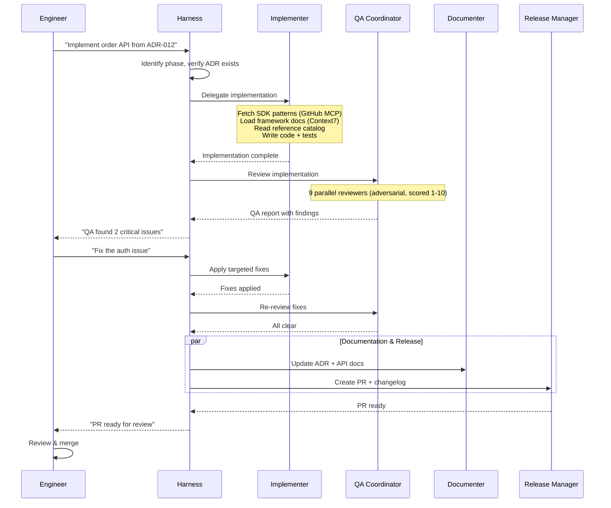

# How Engineers and Agents Work Together

SDLC Harness is designed for **human-AI collaboration** — engineers stay in control
while agents handle the heavy lifting.

## Step 1: Engineer opens a task

An engineer receives a GitHub issue, a feature request, or identifies a bug. They open
VS Code, switch to the **Harness** agent in Copilot Chat, and describe the task:

```text
@Harness Implement the order history API from ADR-012.
It needs Cosmos DB for order data and Blob Storage for invoice PDFs.
```

## Step 2: Harness identifies the phase and delegates

Harness reads the request, identifies this as a **Phase 4 (Implementation)** task,
and checks whether a design exists. If an ADR is referenced, it proceeds. If not, it first
delegates to the **Analyst** agent for a design proposal.

```
Harness
 └─ "This is a Phase 4 task with an existing ADR. Delegating to Implementer."
    └─ Implementer (subagent) starts working...
```

## Step 3: Worker agent executes with MCP-powered context

The **Implementer** agent actively fetches live context:

1. **Fetches the latest SDK patterns and approved libraries** from GitHub MCP
2. **Loads current framework documentation** via Context7 MCP (FastAPI, Pydantic, React, etc.)
3. **Reads the project's reference catalog** to verify approved libraries and scaffolding templates
4. Writes the implementation following established patterns
5. Writes unit tests alongside every new function

The engineer sees the Implementer's work appearing as a collapsible tool call in Chat.

## Step 4: Automatic QA review — 9 perspectives in parallel

After implementation, Harness delegates to the **QA Coordinator**, which spawns
9 independent reviewer subagents **simultaneously**, each with an adversarial QA posture:

```
QA Coordinator (adversarial posture — never downgrade findings)
 ├─ Architecture Reviewer           → layering rules, dependency boundaries
 ├─ Azure Compliance Reviewer       → approved SDK usage, no raw SDK calls
 ├─ Code Quality Reviewer           → naming, docstrings, dead code
 ├─ Security Reviewer               → secrets, injection, auth (loads OWASP fresh)
 ├─ Test Coverage Reviewer          → runs tests, checks coverage, validates assertions
 ├─ Requirements Completeness Rev.  → validates all requirements are addressed
 ├─ UX & Accessibility Reviewer     → ARIA labels, keyboard nav, dark mode
 ├─ LLM Behavior Reviewer           → prompt safety, grounding, citations
 └─ Deployment Readiness Reviewer   → error handling, performance, observability
```

Each reviewer scores 1-10 with hard fail thresholds (Security ≥ 8, others ≥ 7).

## Step 5: Engineer reviews the synthesized QA report

The QA Coordinator synthesizes all 9 perspectives into a single prioritized report:

```
## QA Review Summary

### Quality Scores by Domain
| Reviewer | Score | Threshold | Verdict |
|---|---|---|---|
| Architecture | 8/10 | ≥7 | ✅ Pass |
| Security | 6/10 | ≥8 | ⛔ Fail |
| Code Quality | 7/10 | ≥7 | ✅ Pass |

### Critical Issues (must fix)
- [Security] Endpoint /orders/{id} missing authorization check

### Overall Verdict: ⛔ Request changes — Security score below threshold
```

If the verdict is ⛔, Harness enters the **iterative QA loop**: delegates fixes to the
Implementer, then re-runs only the failing reviewers. This continues up to 3 rounds.

## Step 6: Documentation and release

Once fixes pass, Harness delegates to:
- **Documenter** — updates the ADR with implementation details and creates API docs
- **Release Manager** — generates a changelog, creates a PR, and verifies exit criteria

## The complete flow



## Key principles

- **Engineers stay in control** — agents propose, engineers decide.
- **Agents are transparent** — every subagent call is visible in Chat as a collapsible tool call.
- **Quality is automatic** — 9-perspective QA review with numeric scoring and hard fail thresholds.
- **Context is live** — agents fetch current patterns and docs from MCP servers on every run.
- **The SDLC process is enforced** — no phase is skipped, quality standards are met before release.
